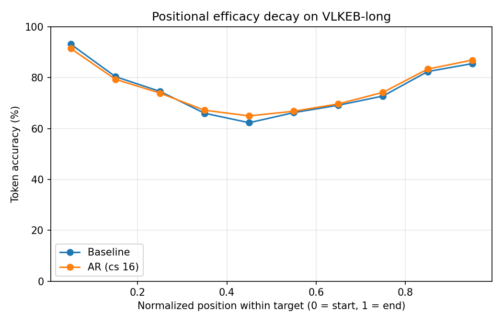

# Positional Efficacy Profile in Long-Form VLM Editing (Workstream A)

**Finding:** Post-edit token accuracy is **not uniform across the answer**. On VLKEB-long it follows a **U-shape**: high at the start, a **mid-answer trough**, and recovery near the end. Autoregressive (AR) chunk-wise editing **concentrates its gains in the hard middle/late region**, which the single +0.54 pp average obscures.

**Protocol:** seed 42, sequential_edit_n=50, n=3150 edits, mean target ~88.6 tokens, teacher-forced per-position scoring. Position is normalized to deciles (0 = first tokens, 9 = last tokens).
**Source runs:** `VLKEB-pos_decay_baseline-2026.06.28-13.27.23`, `VLKEB-ar-pos_decay_ar-2026.06.28-13.52.22`.
**Figure:** `doc/results/results_positional_decay.png`



---

## Per-decile token accuracy (normalized position)

| Decile (pos) | Baseline | AR (cs=16) | Δ (AR − base) |
|--------------|----------|------------|----------------|
| 0 (start) | 93.15% | 91.45% | −1.70 pp |
| 1 | 80.40% | 79.37% | −1.03 pp |
| 2 | 74.60% | 73.92% | −0.68 pp |
| 3 | 66.02% | 67.19% | +1.17 pp |
| 4 (trough) | 62.29% | 64.98% | **+2.69 pp** |
| 5 | 66.27% | 66.80% | +0.53 pp |
| 6 | 69.17% | 69.70% | +0.53 pp |
| 7 | 72.78% | 74.23% | +1.45 pp |
| 8 | 82.39% | 83.36% | +0.97 pp |
| 9 (end) | 85.52% | 86.91% | +1.39 pp |
| **Mean (overall)** | **75.40%** | **75.94%** | **+0.54 pp** |

---

## What this shows

1. **U-shaped positional profile (new characterization).** Accuracy peaks at the answer boundaries (start 93%, end 86%) and bottoms out mid-answer (~62%). The hardest tokens to edit are in the **middle** of a long target, not the end. This is the multimodal-editing analogue of the "lost in the middle" effect known for long-context LLMs, but it has not been shown for *knowledge editing* in VLMs.

2. **AR helps where it is hard.** AR's improvement is concentrated in the mid-to-late region, peaking at the **mid-answer trough (+2.69 pp at decile 4)** and the end (+1.39 pp), at a small cost to the easy opening tokens (−1.70 pp at decile 0). The headline **+0.54 pp average understates** AR's effect in the region that actually limits long-form reliability.

3. **Honest nuance.** AR is slightly worse on the first ~25% of tokens (deciles 0-2). A plausible reason: the single-pass baseline strongly fits the opening tokens of the full target, whereas AR distributes capacity across chunks. This is a real trade-off to report, not hide.

---

## Why this matters for the thesis / paper

- It converts a weak headline ("AR gives +0.54 pp") into a **mechanistic finding**: long-form editing has a structured difficulty profile, and chunk-wise editing targets the difficult middle.
- It motivates the **position-aware / Matryoshka loss** (Workstream C): if the middle is hardest and AR already helps there, a loss that explicitly upweights mid/late tokens (and conditions each early edit on later tokens) should deepen the gain at the trough.
- It is a **VLM-specific, previously-unreported** result built entirely from existing checkpoints (no new training).

---

## Reproduce

```powershell
# 1) eval with positional instrumentation (already added to evaluation/vllm_editor_eval.py)
conda run -n liveedit python -W ignore test_vllm_edit.py -en liveedit -mn blip2 -sen 50 -dvc cuda:0 -dn VLKEB -dsn 3174 -seed 42 -ckpt "<baseline ckpt>" -dpath "<eval_longform_ollama.json>" -enp pos_decay_baseline
conda run -n liveedit python -W ignore test_vllm_edit.py -en liveedit -mn blip2 -sen 50 -dvc cuda:0 -dn VLKEB -dsn 3174 -seed 42 --ar_mode --chunk_size 16 -ckpt "<ar ckpt>" -dpath "<eval_longform_ollama.json>" -enp pos_decay_ar

# 2) plot
conda run -n liveedit python tools/plot_positional_decay.py --run "Baseline=<baseline mean_results.json>" --run "AR (cs 16)=<ar mean_results.json>" --out doc/results/results_positional_decay.png
```

---

## Next (Workstream C hook)

Design the position-aware loss to target the trough: (a) Matryoshka expanding-horizon NLL so each chunk edit also supervises later tokens; (b) optional position weighting upweighting deciles 3-9. Success criterion: lift the trough (decile 4) and late deciles without losing more than ~1 pp at the opening.
