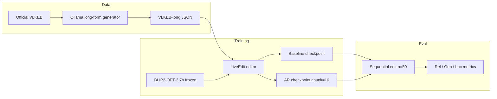
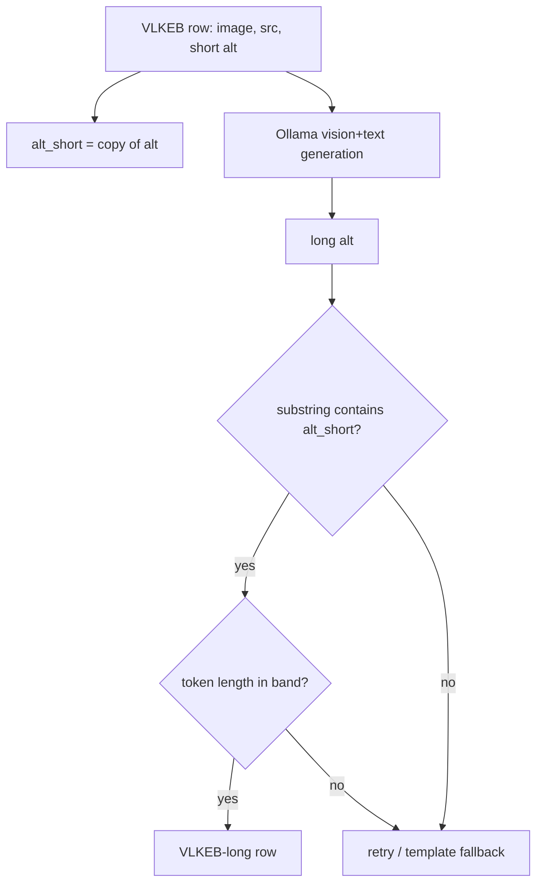
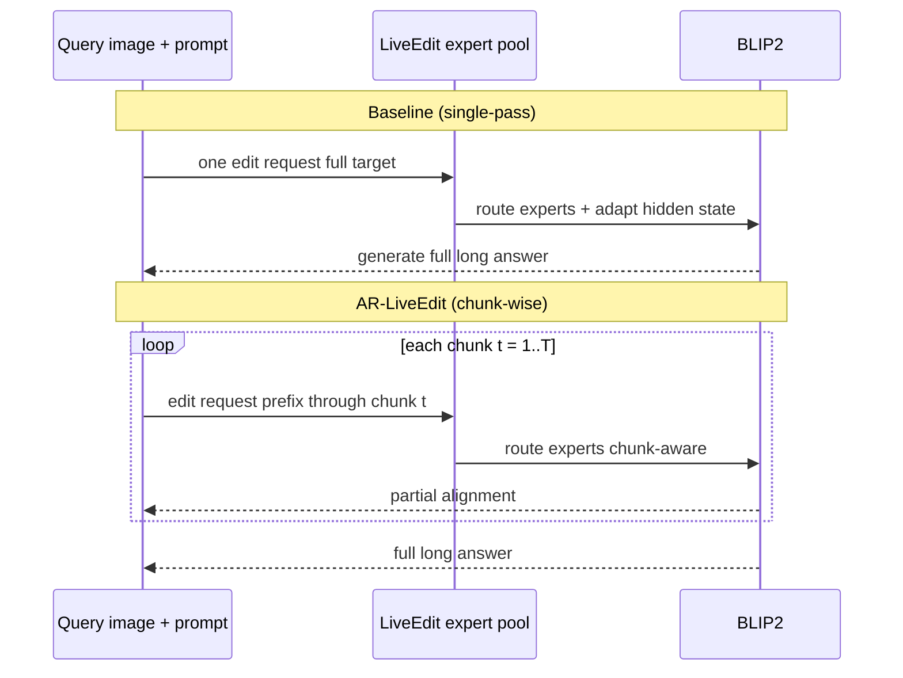
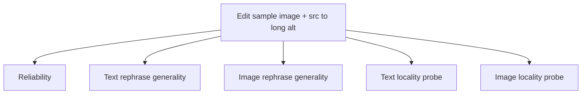
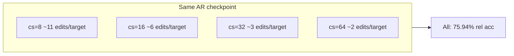
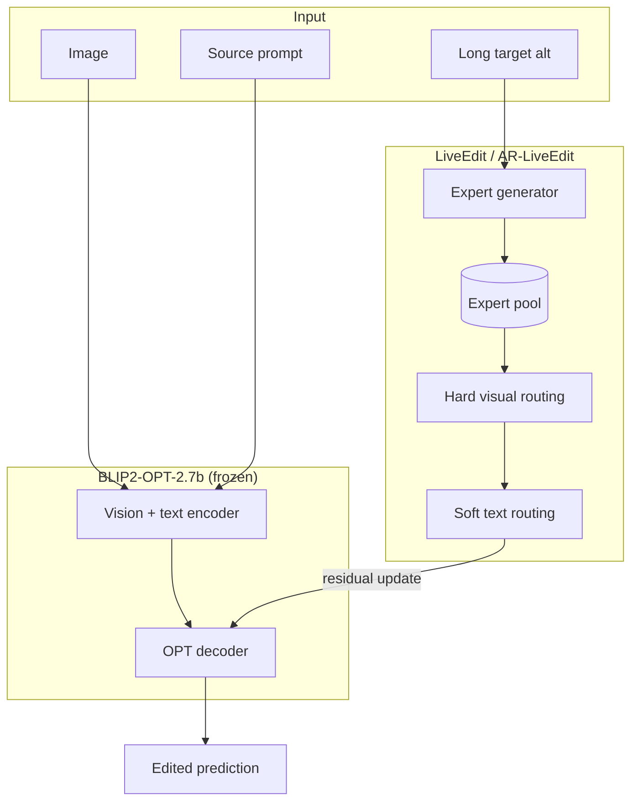
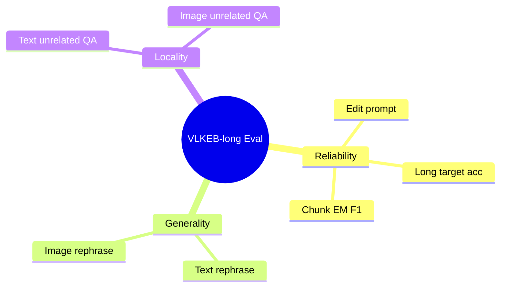
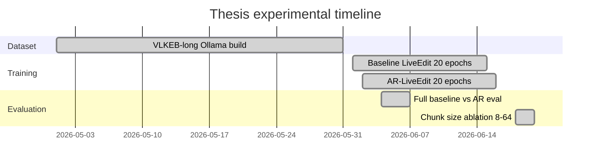
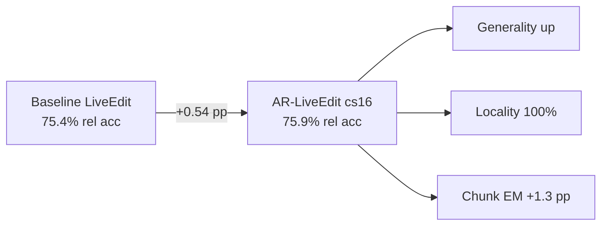

# Thesis Presentation — Long-Form Visual Knowledge Editing with AR-LiveEdit

**Suggested title:** *Autoregressive Chunk-Wise Editing for Long-Form Visual Knowledge in Lifelong VLMs*

**Audience:** MSc thesis progress / defense  
**Duration:** 15–20 minutes (~18 slides)  
**Speaker notes:** bullets under each slide are what you say; tables/figures go on the slide.

---

## Slide 1 — Title

**Title:** Autoregressive Chunk-Wise Editing for Long-Form Visual Knowledge Editing

**Subtitle:** Extending LiveEdit on VLKEB-long (BLIP2-OPT-2.7b)

**Your name, institution, date**

**One line:** We study whether chunk-wise autoregressive editing improves long-form visual knowledge updates without hurting locality.

---

## Slide 2 — Introduction (Motivation)

**Vision–language models (VLMs)** answer questions about images but encode **outdated or wrong facts**.

**Model editing** updates specific knowledge **without full retraining** — critical for privacy, safety, and keeping models current.

**LiveEdit (CVPR 2025)** enables **lifelong** editing for VLMs using a **low-rank mixture-of-experts** editor on benchmarks like **VLKEB**.

**Gap:** Real knowledge is often **long-form** (paragraphs, explanations), not short phrases. Single-pass editors struggle on **65+ token** targets (AnyEdit, ICML 2025).

**Our work:** Extend VLKEB to **VLKEB-long** and evaluate **AR-LiveEdit** — autoregressive chunk-wise editing built on LiveEdit.

---

## Slide 3 — Problem Statement

**Problem:** Standard LiveEdit performs **one edit per sample** on the **full target string**. For long edit targets (~89 tokens on average), this is hard because:

1. **Efficacy barrier** — single-pass hidden-state edits weakly influence distant tokens (AnyEdit).
2. **Metric mismatch** — exact match (EM) collapses to ~0% on long answers; token-level scores matter more.
3. **Sequential lifelong setting** — many edits in a batch can interfere with **locality** (unchanged unrelated facts).

**Research question:**  
*Does autoregressive chunk-wise editing (AR-LiveEdit) improve long-form visual knowledge editing on VLKEB-long compared to standard LiveEdit, while preserving generality and locality?*

**Secondary question:**  
*How does inference chunk size (8 / 16 / 32 / 64 tokens) affect long-form performance when the model is trained with chunk size 16?*

---

## Slide 4 — Objectives & Contributions

| # | Objective | Status |
|---|-----------|--------|
| 1 | Build **VLKEB-long** (long `alt` anchored to original short `alt`) | Done |
| 2 | Train **LiveEdit baseline** and **AR-LiveEdit** on full long-form train split | Done |
| 3 | Full eval on **~3150** sequential edits (seed 42) | Done |
| 4 | Compare **baseline vs AR** (reliability, generality, locality) | Done |
| 5 | **Chunk size ablation** at inference (8, 16, 32, 64) | Done |

**Contributions (so far):**
- VLKEB-long dataset + reproducible Ollama pipeline (`vlkeb_long_ollama/`)
- Empirical study of AR vs baseline on long-form VLKEB
- Chunk-size ablation with analysis of metric comparability

---

## Slide 5 — Literature Review: Model Editing

**Classic LLM editing** (ROME, MEMIT, MEND): locate factual association → patch weights or use hypernetworks.

**Standard metrics** (Meng et al.; AnyEdit):
- **Efficacy / Reliability** — model outputs new target on edit prompt
- **Generalization** — works on paraphrased prompts
- **Specificity / Locality** — unrelated knowledge unchanged

**Limitation for long text:** methods edit **one key token** or short span → **efficacy barrier** for 65+ token targets.

---

## Slide 6 — Literature Review: LiveEdit (Chen et al., CVPR 2025)

**LiveEdit** — lifelong **vision–language** model editing:

- Trains an **expert generator** → low-rank experts per edit
- **Hard routing** filters visually irrelevant experts
- **Soft routing** fuses textually relevant experts
- Losses: reliability + generality + **KL locality**

**VLKEB benchmark:** image + prompt → short edit target; metrics **Rel., T-Gen., M-Gen., T-Loc., M-Loc.** (token accuracy %).

**Gap for our thesis:** VLKEB targets are **short**; long-form VLM editing is **under-studied**.

---

## Slide 7 — Literature Review: AnyEdit (ICML 2025)

**AnyEdit** — autoregressive editing for **long-form LLM** knowledge:

- Split target into **chunks**; edit key token per chunk iteratively
- Motivated by **chain rule of mutual information**
- Evaluates long outputs with **ROUGE-L**, **BERTScore**, not only EM

**Relevance:** We adopt **chunk-wise editing** inside **LiveEdit’s VLM + lifelong** framework → **AR-LiveEdit**.

**Difference:** AnyEdit is **LLM-only**; we edit **BLIP2** with **images** and **sequential expert pool** (LiveEdit).

---

## Slide 8 — Research Gap (Positioning)

```mermaid
quadrantChart
    title Positioning: Lifelong VLM editing vs target length
    x Short targets --> Long targets
    y Single-pass edit --> Chunk-wise AR edit
    quadrant-1 Our thesis (AR-LiveEdit on VLKEB-long)
    quadrant-2 AnyEdit (LLM long-form)
    quadrant-3 LiveEdit (VLM short-form VLKEB)
    quadrant-4 Open area (VLM long-form lifelong)
```

| Work | Modality | Lifelong | Long targets |
|------|----------|----------|--------------|
| ROME / MEMIT / MEND | LLM | Limited | Poor |
| AnyEdit | LLM | Batch edits | Strong |
| **LiveEdit** | **VLM** | **Yes** | Short VLKEB |
| **This thesis** | **VLM** | **Yes (seq=50)** | **VLKEB-long** |

---

## Slide 9 — Methodology Overview



**Pipeline:** VLKEB → long targets → train LiveEdit (baseline & AR) → full eval → compare.

---

## Slide 10 — Methodology: VLKEB-long Dataset

**Source:** Official `train.json` / `eval.json` + images (**unchanged**).

**Extension per row:**
- `alt_short` = original short `alt`
- `alt` = long-form string (~65–150 tokens) via **Ollama** (e.g. gemma4:31b-cloud)

**Validation:**
- `alt_short` must appear as **substring** in long `alt`
- Token length band (BLIP2 tokenizer)
- `manifest.json` for reproducibility

**Scale:** ~3174 eval rows; **3150** used in full sequential eval.

**Honest limit:** Lexical anchoring ≠ full visual grounding of every sentence.



---

## Slide 11 — Methodology: LiveEdit vs AR-LiveEdit

**LiveEdit (baseline):** one `edit_one_piece` call → full `target_new`.

**AR-LiveEdit:** split `target_new` into token chunks (default **size 16**) → sequential chunk edits → cumulative target reconstructed.



**Training:** same backbone; AR enables `ar_mode` + chunk loss aggregation during training.

---

## Slide 12 — Methodology: Evaluation Protocol

**Benchmark:** VLKEB-long eval JSON, images from `mmkb_images`.

**Setting:** `sequential_edit_n = 50`, `seed = 42`, full split (~3150 edits).

| Metric | What it measures |
|--------|------------------|
| **Reliability (acc)** | Token accuracy on edit prompt → long target |
| **Text generality** | Rephrased text prompt |
| **Image generality** | Rephrased image |
| **Text / image locality** | Unrelated QA unchanged |
| **Chunk EM / F1** | Per-chunk exact match & token F1 (AR-relevant) |
| **Length bin 65+** | Almost all samples (~3149) |



**Models compared:**
- Baseline: epoch-20, ema_loss 0.79
- AR: epoch-20, chunk_size 16, ema_loss 1.51

---

## Slide 13 — Results: Baseline vs AR (Main)

**Headline:** AR-LiveEdit **improves** long-form editing **without locality drop**.

| Metric | Baseline | AR (cs=16) | Δ |
|--------|----------|------------|---|
| Reliability acc | 75.40% | 75.94% | **+0.54 pp** |
| Chunk EM | 13.50% | 14.82% | **+1.32 pp** |
| Chunk F1 | 76.28% | 76.90% | **+0.62 pp** |
| Text rephrase | 75.21% | 75.63% | +0.42 pp |
| Image rephrase | 71.49% | 72.51% | +1.02 pp |
| Locality (text / image) | 100% / 100% | 100% / 100% | 0 |
| Exact match | 0% | 0% | — |
| Mean target length | 88.6 tokens | 88.6 tokens | — |

```mermaid
xychart-beta
    title "Baseline vs AR — key metrics (%)"
    x-axis [Rel_acc, Chunk_EM, Chunk_F1, Text_gen, Image_gen]
    y-axis "Accuracy %" 70 --> 80
    bar [75.4, 13.5, 76.3, 75.2, 71.5]
    bar [75.9, 14.8, 76.9, 75.6, 72.5]
```



*Chart: first bar = baseline, second bar = AR per group.*

**Validation:** Long-form improvement ✓ | Locality bounded ✓

---

## Slide 14 — Results: Chunk Size Ablation (AR only)

Same AR checkpoint; vary **inference** chunk size.

| chunk_size | Rel acc | Chunk EM | Chunk F1 | Locality |
|------------|---------|----------|----------|----------|
| 8 | 75.94% | 26.26% | 76.48% | 100% |
| **16** | **75.94%** | **14.82%** | **76.90%** | **100%** |
| 32 | 75.94% | 8.11% | 77.30% | 100% |
| 64 | 75.94% | 6.14% | 77.88% | 100% |

**Finding:** Token accuracy **identical** across chunk sizes; **cs=16** matches training and is the recommended default.

**Caveat:** Chunk EM is **not comparable** across sizes (different window); use token acc + chunk F1 at fixed window for fair comparison.



---

## Slide 15 — Discussion

**What worked**
- AR gives **consistent** gains on reliability and chunk metrics (+0.5–1.3 pp).
- **Generality** improves; **locality** stays at 100% on this run.
- Chunk-wise mechanism aligns with larger **chunk EM** gain vs raw acc.

**Interpretation**
- Gains are **modest** but **directionally consistent** on a new long-form split.
- **EM = 0%** expected for ~89-token targets → report token acc / chunk F1.
- Inference chunk size **does not change** token acc if training used cs=16.

**Limitations**
- Single backbone (**BLIP2-OPT-2.7b** only).
- Long `alt` is **lexically anchored**, not fully human-verified visual grounding.
- No ROUGE-L / BERTScore in reported numbers yet (planned in checklist).
- AR training loss higher than baseline at epoch 20 — still improves eval.

---

## Slide 16 — Limitations & Future Work

| Limitation | Future direction |
|------------|------------------|
| Small absolute gains | More seeds, significance tests |
| Dataset grounding | Human audit subset + grounding tiers |
| Metrics | ROUGE-L, BERTScore for long-form |
| Novelty beyond engineering | Vision-gated chunks, edit-budget optimality, forgetting analysis |
| Single VLLM | Second backbone (LLaVA) |
| Lifelong depth | Edit-count sweep 1 → 1000 |

---

## Slide 17 — Conclusion

1. Built **VLKEB-long** — long-form visual knowledge editing benchmark extension with documented protocol.
2. Implemented and evaluated **AR-LiveEdit** on **BLIP2 + LiveEdit** at full scale (~3150 edits).
3. **AR beats baseline** on reliability (+0.54 pp), chunk EM (+1.32 pp), and generality, with **no locality loss**.
4. **Chunk size 16** is the sensible default (matches training; inference-only retuning does not help token acc).

**Take-home message:** Autoregressive chunk-wise editing is a **viable extension** of LiveEdit for long-form VLM knowledge editing, with honest limits on effect size and dataset grounding.

---

## Slide 18 — Q&A / Backup

**Backup slides (optional):**
- LiveEdit architecture diagram (from CVPR paper Figure 2)
- Training hyperparameters table (epochs=20, bs=4, chunk=16)
- Paths to result JSONs: `eval_results/comparison/`
- 2 template-fallback rows in eval (disclose in Q&A)

**Anticipated questions:**
- *Why is improvement so small?* → Hard task, long outputs, sequential editing, single seed.
- *Is VLKEB-long novel?* → Extension + protocol; not new images; anchoring is explicit.
- *Why not EM?* → ~89 tokens; EM is structurally zero; use token/chunk metrics.

---

# Visual Diagrams (copy into slides)

## Diagram A — End-to-end system architecture



## Diagram B — Three evaluation dimensions (LiveEdit standard)



## Diagram C — Timeline of work completed



## Diagram D — Results summary (for one slide)



---

# How to use this file

1. **PowerPoint / Google Slides:** One section = one slide; copy title + bullet + table.
2. **Diagrams:** Paste mermaid blocks into [mermaid.live](https://mermaid.live) → export PNG/SVG → insert in slides.
3. **LiveEdit paper figure:** Use Figure 1–2 from Chen et al. CVPR 2025 for architecture backup slide (with citation).
4. **Suggested slide count:** 18 main + 2–3 backup ≈ 20 minutes.

**Result files for screenshots (optional):**
- `eval_results/comparison/liveedit_vs_ar_seed42_longform.json`
- `eval_results/comparison/baseline_vs_ar_all_chunks.json`
- `eval_results/comparison/ar_chunk_size_sweep.json`
