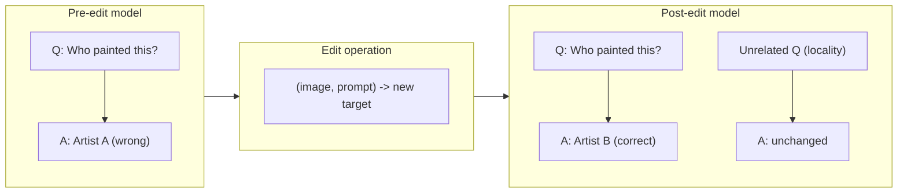
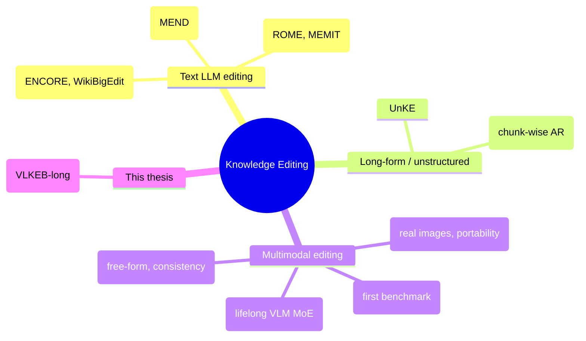
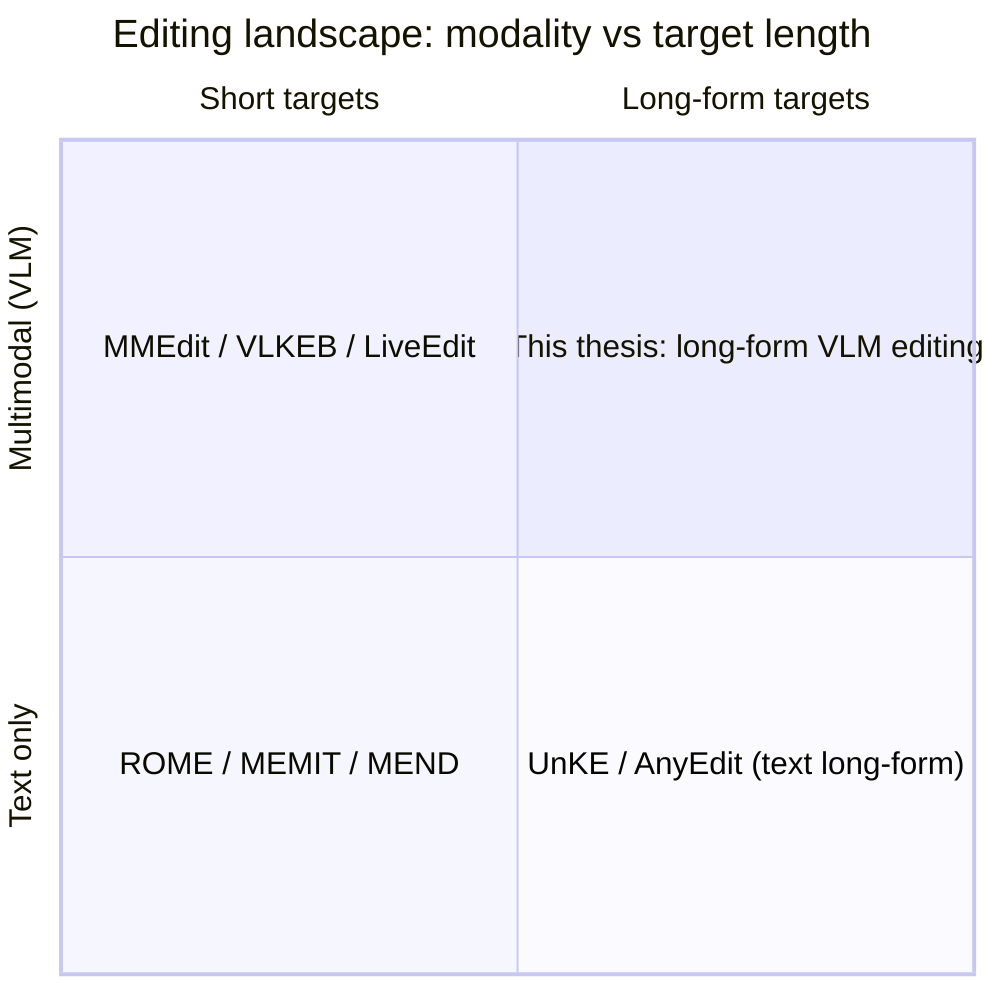
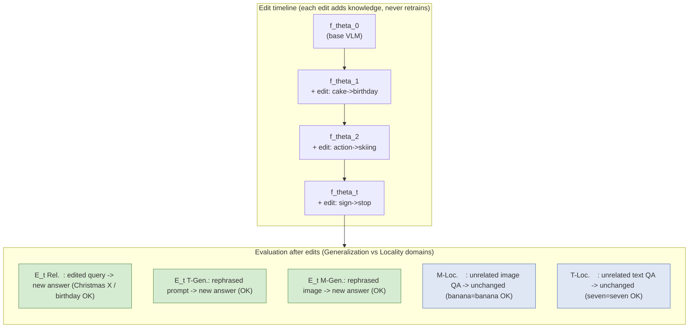
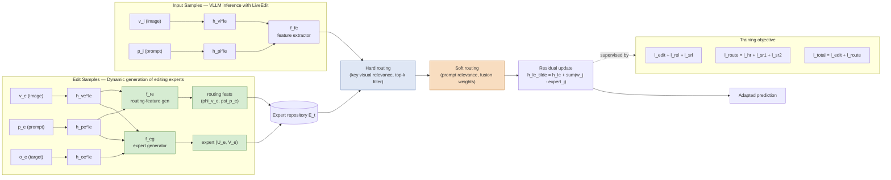
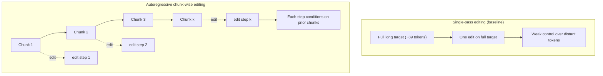
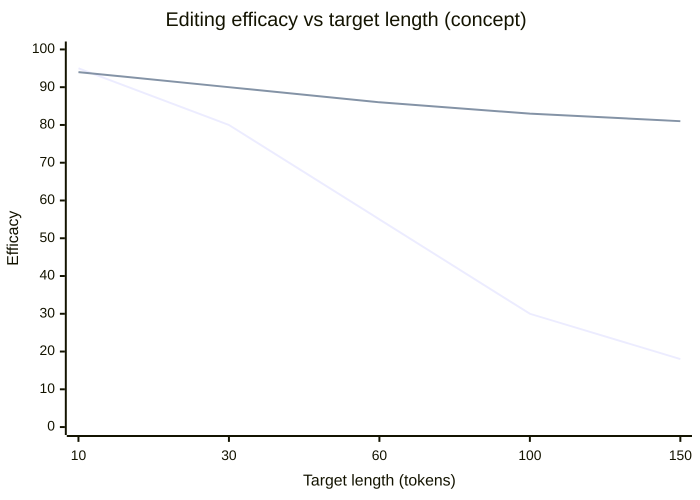
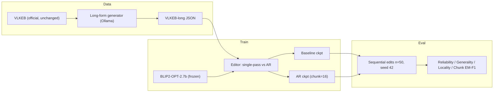
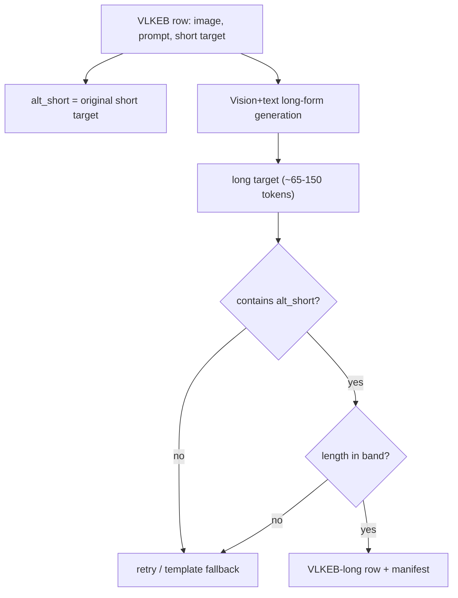

# Thesis Presentation (V4) — Long-Form Knowledge Editing for Vision–Language Models

**Title:** *Autoregressive Chunk-Wise Editing for Long-Form Knowledge in Vision–Language Models*

**Audience:** MSc thesis progress / defense · **Duration:** ~22–24 min · **Slides:** 25 + backup

> V4 changes vs V3: **Methodology slides (14–19) expanded with descriptive presenter points** — plain-language talk track for each step (problem setup, chunking, training, metrics, pipeline, benchmark build). Math notation unchanged from V3.

---

## Slide 1 — Title

**Autoregressive Chunk-Wise Editing for Long-Form Knowledge in Vision–Language Models**

Subtitle: A study on the VLKEB-long benchmark with BLIP2-OPT-2.7b

[Your Name] · [Supervisor] · [Institution] · June 2026

---

## Slide 2 — Introduction (domain-general)

**Large models memorize facts during pre-training** — but facts go **stale, wrong, or harmful** over time (events change, errors surface, biases appear).

**Retraining is expensive and risky** (cost, carbon, overfitting, regression).

**Knowledge editing** is the lightweight alternative: change a *specific* fact while leaving everything else intact.

A good edit must satisfy three classic properties:

- **Reliability / Efficacy** — the target fact is actually updated
- **Generality** — the update holds for paraphrases / rephrasings
- **Locality / Specificity** — unrelated knowledge is preserved

**Two open frontiers** motivate this thesis (independent of any single method):

1. **Multimodality** — editing **vision–language models (VLMs)**, where image + text interact, is far less mature than text-only editing.
2. **Long-form knowledge** — real updates are often **sentences or paragraphs**, not single words; most editors are built and benchmarked for **short** targets.

---

## Slide 3 — Problem Statement (domain-general)

**Core problem:** Current knowledge-editing methods and benchmarks are dominated by **short, triplet-style targets** (e.g. *capital → city*). They do not adequately address **long-form** edits in **multimodal** models.

This creates three concrete difficulties:

1. **Efficacy degrades with length** — editing techniques that adjust a few hidden states lose influence over long outputs (tokens far from the edit point).
2. **Evaluation breaks down** — exact-match is near-zero for long answers; token-, chunk-, and semantic-level metrics are needed.
3. **Lifelong interference** — applying many edits sequentially can erode locality and earlier edits, especially when each long edit requires more updates.

**Research questions (method-agnostic):**

- **RQ1:** Can **autoregressive, chunk-wise editing** improve long-form knowledge updates in VLMs while preserving generality and locality?
- **RQ2:** How does the **granularity (chunk size)** of editing affect long-form performance?

**Scope of this thesis:** a controlled study on a long-form multimodal editing benchmark (VLKEB-long), using a representative editor and backbone.

---

## Slide 4 — Aim, Objectives & Contributions

**Aim:** Investigate whether decomposing long edit targets into chunks and editing them autoregressively benefits long-form multimodal knowledge editing.

| # | Objective | Status |
|---|-----------|--------|
| 1 | Construct a long-form multimodal editing benchmark (VLKEB-long) | Done |
| 2 | Implement chunk-wise autoregressive editing in a representative editor | Done |
| 3 | Train single-pass (baseline) vs autoregressive variants | Done |
| 4 | Full-scale evaluation (~3150 sequential edits) | Done |
| 5 | Granularity ablation (chunk size 8/16/32/64) | Done |

**Contributions:** (i) long-form multimodal benchmark + reproducible build protocol; (ii) empirical comparison of single-pass vs chunk-wise editing; (iii) granularity analysis and metric-comparability discussion.

---

## Slide 5 — Background: what is a "knowledge edit"?

An edit changes the **target response** while a **locality probe** must stay unchanged.

---

## Slide 6 — Literature Review (overview map)

---

## Slide 7 — Literature Review (1/3): Foundations & surveys

| Work | Year | Contribution | Relevance |
|------|------|-------------|-----------|
| **Knowledge Editing Survey** (Wang et al.) | 2023–24 | Formalizes editing as constrained optimization over **accuracy, locality, generality**; taxonomy: external memory / global opt / local modification | Defines the metric triple we use |
| **Pitfalls of Knowledge Editing** (survey) | 2024 | Shows editing causes **knowledge distortion** and **degraded general ability**; calls for consistent metrics | Motivates careful eval + locality focus |
| **Dual-Axis Taxonomy** | 2025 | Adds a **function-based** view (factual/temporal/conceptual/…); effectiveness depends on **knowledge type** | Long-form is a distinct, harder type |

**Takeaway:** editing is well-formalized for **short factual** knowledge; long-form and multimodal cases are flagged as **open**.

---

## Slide 8 — Literature Review (2/3): Lifelong & long-form editing

| Work | Year | Contribution | Relevance |
|------|------|-------------|-----------|
| **WikiBigEdit** | 2025 | 500K+ real Wikidata edits; tests **lifelong editing at scale** | Realistic sequential-edit pressure |
| **ENCORE — lifelong sequential editing** | 2025 | Norm-constrained edits; **10,000 sequential edits** without degradation | Locality/forgetting under many edits |
| **UnKE** | 2025 | Edits **unstructured / long** knowledge by moving beyond single-token updates | Long-form editing in text |
| **AnyEdit** (base) | 2025 | **Autoregressive chunk-wise** editing; chain-rule-of-MI motivation; long-form metrics (ROUGE-L, BERTScore) | Core mechanism we adapt to VLMs |

**Takeaway:** chunk-wise / autoregressive editing solves the **length** problem **in text**; not yet studied for **vision–language** models.

---

## Slide 9 — Literature Review (3/3): Multimodal editing & benchmarks

| Work | Year | Contribution | Relevance |
|------|------|-------------|-----------|
| **MMEdit** | 2023 | First multimodal editing benchmark (VQA + caption) | Origin of multimodal editing eval |
| **VLKEB** | 2024 | **Real images** via multimodal KG; adds **Portability**; harder locality | Our base benchmark (short targets) |
| **MMKE-Bench** | ICLR 2025 | **Free-form** visual knowledge; entity/semantic/user edits | Argues for natural-language (long) edits |
| **MC-MKE** | ACL 2025 | Fine-grained edits emphasizing **modality consistency** | Motivates careful multimodal metrics |
| **LiveEdit** (base) | CVPR 2025 | **Lifelong VLM editing** via low-rank **mixture-of-experts** + routing | Editor we build on |

**Gap identified:** No prior work studies **long-form** targets in a **lifelong VLM** editing setting — this thesis fills that gap (VLKEB-long + chunk-wise AR).

---

## Slide 10 — Research Gap (positioning)

The **upper-right** quadrant — long-form + multimodal — is under-explored.

---

## Slide 11 — Concept Diagram (LiveEdit Fig. 1 style): Lifelong VLM editing

> Recreates LiveEdit Figure 1: a timeline of edits `f_θ0 → f_θ1 → … → f_θt`, where after each edit the model is checked on Reliability, Generality (T-/M-Gen), and Locality (T-/M-Loc). Pre-edit answers are wrong (✗); post-edit answers become correct (✓) while locality stays unchanged.

**Key idea:** across many sequential edits, the model must answer **edited + related (generalization domain)** queries correctly while keeping **unrelated (locality domain)** answers unchanged.

---

## Slide 12 — Architecture Diagram (LiveEdit Fig. 2 style): MoE editor

> Recreates LiveEdit Figure 2. **Top stream** = editing: edit sample `(v_e, p_e, o_e)` → layer-`l_e` hidden states → expert generator `f_eg` produces a low-rank expert `(U_e, V_e)` and routing features `(φ̂_ve, ψ̂_pe)` via `f_re`, both stored in expert repository `E_t`. **Bottom stream** = inference: input `(v_i, p_i)` → `f_fe` extracts features → **hard routing** (key visual relevance, top-k) → **soft routing** (prompt relevance, fusion weights) → residual update of the representation.

**Legend (as in the paper):** green = dynamic expert generation · blue = hard routing via key visual relevance · orange = soft routing via prompt relevance. **The editor is external** to the frozen VLM and experts accumulate per edit (lifelong).

---

## Slide 13 — Mechanism Diagram (AnyEdit Fig. 1 style): single-pass vs autoregressive

> Recreates the **single-token vs autoregressive chunk editing** contrast and the **efficacy-vs-length** intuition.

*Lower line = single-pass (drops with length); upper line = autoregressive (stays high).*

---

## Slide 14 — Methodology (math): formal edit problem

**What to say:** We treat each edit as a multimodal fact update — not retraining the whole model, but injecting one new long answer for one (image, question) pair.

**Notation.** Let the frozen VLM be **f**_θ. An edit request is a tuple:

    e = (v, p, y^*)

where **v** = image, **p** = text prompt, and target y^* is the desired long-form answer (**L** tokens).

**Edited model.** External editor **E** updates editor state after each edit; VLM weights stay frozen:

    f_{θ_t} = E(f_{θ_{t-1}}, e_t)          θ_t = θ_{t-1}   (VLM frozen)

**Descriptive points:**

- The **VLM backbone stays frozen** — all learning happens in the external LiveEdit editor (MoE experts + routing).
- Each lifelong edit adds state to the editor repository; we never fine-tune BLIP2 weights on the full benchmark.
- Success is measured on **three probe types**, not just “did the edited answer change?”

**Three evaluation domains** (LiveEdit / VLKEB protocol):

| Domain | Query | Requirement |
|--------|-------|-------------|
| **Reliability** | (v, p) | ŷ = y^* |
| **Generality** | (v′, p′) rephrased | ŷ = y^* |
| **Locality** | unrelated (v_ℓ, p_ℓ) | ŷ_ℓ = y_ℓ^{pre} |

- **Reliability** — the edited model must produce the new long target on the original image + prompt.
- **Generality** — the same fact must hold when the **prompt is rephrased** or the **image is swapped** for a related view.
- **Locality** — answers to **unrelated** text/image questions must stay identical to pre-edit behaviour.

**Objective (informal).** Maximize reliability and generality while limiting locality drift under sequential edits e₁, e₂, …, e_T.

---

## Slide 15 — Methodology (math): chunk decomposition & AR loop

**What to say:** Long answers (~89 tokens) are hard to edit in one shot; we split the target into chunks and apply edits autoregressively, building up the answer piece by piece.

**Token chunking** (chunk size **s**, default **s = 16**). Tokenize target y^* into token IDs and partition:

    y^* = Dec(c₁ ‖ c₂ ‖ … ‖ c_K),     |c_k| ≤ s

Implementation: `split_target_into_chunks(tokenizer, y^*, s)`.

**Descriptive points:**

- Chunking is **token-based** (BLIP2 tokenizer), not sentence-based — consistent with the editor’s token-level loss.
- Default **s = 16** balances edit granularity vs number of expert inserts per sample.
- Each chunk is a contiguous token block; the full long target is the concatenation of all chunks.

**Single-pass baseline** — one expert per request on the **full** target:

    E_{SP}(e):   E_t ← E_{t−1} ∪ { (U_e, V_e, φ̂_v, ψ̂_p) }

- Baseline stores **one** low-rank expert per edit, trained to predict the **entire** long target at once.
- This mirrors original LiveEdit but on VLKEB-long targets — our control condition.

**Autoregressive chunk-wise edit** — for k = 1, …, K, define the **prefix target**:

    y_k = Dec(c₁, …, c_k)

Append one expert per step (chunk index **k** stored for routing):

    E_{AR}(e):   for k = 1..K:   E_t ← E_{t−1} ∪ Expert(v, p, y_k)

- At step **k**, the edit target is the **prefix** up to chunk k — the model is trained to “know” progressively more of the answer.
- Each step adds a **separate expert** tagged with chunk index **k** for chunk-aware routing at inference.
- If chunking fails, the code **falls back** to single-pass editing on the full target.

**Theoretical motivation** (AnyEdit / MI chain rule; frozen image prefix **V**):

    I(X, V ; Y | h′₁, …, h′_K)  =  Σ_{k=1..K}  I(X, V, Y_{<k} ; Y_k | h′_k)

- AnyEdit shows long-form text editing improves when conditioned on **prior chunks**; we extend this idea to VLMs.
- Because the **image encoder is frozen**, visual context **V** acts as a fixed prefix — the decomposition still applies.

Long targets decompose into **conditionally independent sub-problems** per chunk, improving control over distant tokens.

---

## Slide 16 — Methodology (math): MoE residual update & training loss

**What to say:** LiveEdit learns small low-rank “expert” patches applied to hidden states; training jointly optimizes edit quality, generality, locality, and routing.

**Low-rank expert** at edit layer **ℓ_e**. Hidden states **h^ℓ ∈ ℝ^{L×d}**, retrieved experts **(U_j, V_j)**, fusion weights **w_j**:

    h̃^{ℓ}  =  h^{ℓ}  +  Σ_{j∈R}  w_j · Expert_j(h^{ℓ})

    Expert_j(h)  =  ReLU(h · U_j) · V_j

    w_j  =  softmax(sim_j)  ⊙  σ(sim_j)

where **sim_j = (1/√d_m) · ⟨ψ_i, φ_j⟩** (soft routing); hard routing keeps experts with **sim^{vis}_j > sim^{prot}**.

**Descriptive points:**

- **Hard routing** (visual): retrieve experts whose stored image features match the current input image.
- **Soft routing** (text): weight experts by prompt similarity — fuse multiple experts when several edits are relevant.
- The edit is a **residual** added at one mid-layer — the VLM forward pass otherwise unchanged.

**Training loss** (LiveEdit editor modules only; VLM frozen):

    L_{total} = λ_{rel}·L_{rel} + λ_{gen}·L_{gen} + λ_{loc}·L_{loc} + λ_{sr}·L_{sr} + λ_{hr}·L_{hr}

- **Reliability** (masked NLL):  L_{rel} = −(1/|M|) · Σ_{i∈M} log p_θ(y_i | v, p, y_{<i})
  - Teaches the editor to predict the **new target tokens** on the edited (image, prompt).
- **AR variant:**  L_{rel} = (1/K) · Σ_k L_{rel}^{(k)}  over token positions in chunk c_k
  - AR averages **per-chunk** NLL — each chunk’s tokens supervised separately within one forward pass.
- **Generality:** same NLL on rephrased (v′, p′) probes
  - Ensures the edit survives **paraphrased** text and **rephrased** images.
- **Locality:**  L_{loc} = KL(p_{pre} ‖ p_{edit})  on unrelated probes
  - Penalizes logit drift on locality questions — keeps unrelated answers stable.
- **Routing:** contrastive NLL on hard (visual) and soft (textual) neighbor/prototype pairs
  - Trains the router to pick the **right expert** and ignore irrelevant ones in the pool.

**Training setup:** 20 epochs on VLKEB-long train split; BLIP2-OPT-2.7b frozen; only editor modules updated.

---

## Slide 17 — Methodology (math): evaluation metrics

**What to say:** Standard exact match fails on ~89-token answers; we report token-level and chunk-level metrics under a fixed lifelong eval protocol.

**Token accuracy** (reliability / generality):

    Acc = (1/N) · Σ_i  1[y_i = ŷ_i]     over masked target tokens

- Primary **reliability** score: fraction of target tokens predicted correctly after editing.
- Same metric applied to **text-** and **image-generality** probes.

**Exact match (EM):**  EM = 1[y^* = ŷ]  — expected **≈ 0** when **L ≈ 89**.

- Verbatim string match is **too strict** for long-form outputs — included for completeness, not as headline result.

**Chunk EM & Chunk F1** (chunk size **s**, aligned windows [start, start+s)):

    Chunk-EM = (1/|C|) · Σ_c  1[ŷ_c = y_c]

    Chunk-F1_c = (Σ_i  1[ŷ_i = y_i] · m_i) / (Σ_i m_i)

    Chunk-F1 = (1/|C|) · Σ_c  Chunk-F1_c

- **Chunk EM** — fraction of token windows where **every** token in the window is correct (AnyEdit-style segment match).
- **Chunk F1** — average per-window token overlap; more forgiving than chunk EM, still length-aware.
- Both use **s = 16** at eval unless ablating chunk size (Slide 21).

*Note:* Chunk EM is **not comparable across chunk sizes** (different window count).

**Locality accuracy:** fraction of locality probes where edited model matches pre-edit answer.

- Reported separately for **text** and **image** locality probes from VLKEB.

**Lifelong protocol:** sequential batches of **n = 50** edits, seed 42, **T ≈ 3150** total edits on VLKEB-long eval.

- Edits applied **sequentially** — later edits see the full expert pool from earlier edits (lifelong stress test).
- Fixed **seed 42** for reproducibility; same protocol for baseline and AR checkpoints.

---

## Slide 18 — Methodology: overall pipeline

**What to say:** Three stages — build the long-form benchmark, train two editor variants, evaluate under identical lifelong conditions.

**Descriptive points:**

| Stage | What happens | Why it matters |
|-------|----------------|----------------|
| **Data** | Official VLKEB images/prompts kept; only targets elongated via Ollama | Isolates the **long-form** variable without changing multimodal structure |
| **Train** | Same backbone + same train split; only difference is **single-pass vs AR** editing | Fair comparison — one controlled mechanism change |
| **Eval** | Both checkpoints run on full VLKEB-long eval with **3150 sequential edits** | Tests long-form gains **and** lifelong stability on the same benchmark |

- **Controlled comparison:** identical data, backbone, training budget; only the edit mechanism differs.
- **Two checkpoints:** baseline (full-target edit) vs AR (chunk size 16 at train and default eval).
- **Outputs:** JSON result artifacts under `eval_results/comparison/` for thesis tables.

---

## Slide 19 — Methodology: VLKEB-long construction

**What to say:** We extend VLKEB by elongating edit targets while anchoring each long answer to the original short fact — reproducible, automated, with explicit quality gates.

**Descriptive points:**

- **Inputs preserved:** same image files, prompts, generality rephrases, and locality probes as official VLKEB.
- **Generation:** Ollama vision+text model produces a **paragraph-length** answer given image + question + short fact.
- **Anchoring gate:** long target must **contain** the original short string `alt_short` — ties long text to the verified short fact.
- **Length gate:** target must fall in **~65–150 tokens** — excludes too-short or runaway generations.
- **Retry / fallback:** failed rows re-prompted or filled from template so the benchmark stays complete.

- Official data/images **unchanged**; only the target is elongated and **anchored** to the original.
- **3174** eval rows; **3150** edits used; mean length **~89 tokens**.
- Honest limit: **lexical anchoring**, not full visual grounding of every clause — long text may add detail beyond what is visually verified.

**Reproducibility:** construction script + manifest document row-level pass/fail for each quality gate.

---

## Slide 20 — Results: single-pass vs autoregressive

| Metric | Baseline | AR (cs=16) | Δ |
|--------|----------|------------|---|
| Reliability acc | 75.40% | 75.94% | +0.54 pp |
| Chunk EM | 13.50% | 14.82% | +1.32 pp |
| Chunk F1 | 76.28% | 76.90% | +0.62 pp |
| Text generality | 75.21% | 75.63% | +0.42 pp |
| Image generality | 71.49% | 72.51% | +1.02 pp |
| Locality (text/image) | 100%/100% | 100%/100% | 0 |
| Exact match | 0% | 0% | — |

```mermaid
xychart-beta
    title "Baseline vs AR (key metrics, %)"
    x-axis ["Rel acc", "Chunk EM", "Chunk F1", "Text gen", "Image gen"]
    y-axis "Percent" 0 --> 100
    bar [75.4, 13.5, 76.3, 75.2, 71.5]
    bar [75.9, 14.8, 76.9, 75.6, 72.5]
```

**Validation:** long-form improvement ✓ · locality bounded ✓ · n=3150, seed 42.

---

## Slide 21 — Results: granularity (chunk size) ablation

| chunk_size | Rel acc | Chunk EM | Chunk F1 | Locality |
|------------|---------|----------|----------|----------|
| 8 | 75.94% | 26.26% | 76.48% | 100% |
| **16** | **75.94%** | **14.82%** | **76.90%** | **100%** |
| 32 | 75.94% | 8.11% | 77.30% | 100% |
| 64 | 75.94% | 6.14% | 77.88% | 100% |

- Token accuracy **identical** across chunk sizes → inference granularity alone does not change reliability.
- **cs=16** matches training and is the recommended default.
- Chunk EM is **not comparable** across sizes (different scoring windows).

---

## Slide 22 — Discussion

- AR yields **consistent, modest** gains (reliability +0.54 pp, chunk EM +1.32 pp) with **no locality cost**.
- Generality improves on both text and image rephrases.
- **EM ≈ 0%** is expected for ~89-token targets → report token/chunk metrics.
- Inference chunk size is **secondary** when training uses cs=16.
- Limits: **single backbone** (BLIP2), **lexical** (not human-verified visual) anchoring, no ROUGE-L/BERTScore in current numbers.

---

## Slide 23 — Limitations & Future Work

| Limitation | Future direction |
|------------|------------------|
| Modest effect size | Multiple seeds, significance tests |
| Lexical anchoring | Human audit + grounding-verified tiers |
| Metric set | Add ROUGE-L, BERTScore (long-form) |
| Mechanism novelty | **Vision-gated** chunking; **edit-budget** optimality; **forgetting** dynamics |
| One backbone | Add LLaVA / MiniGPT-4 |
| Lifelong depth | Edit-count sweep 1 → 1000 |

---

## Slide 24 — Conclusion

1. Identified an open gap: **long-form** editing in **multimodal, lifelong** settings.
2. Built **VLKEB-long** and a reproducible long-form construction protocol.
3. Showed **autoregressive chunk-wise editing** improves long-form reliability and chunk match **without locality loss**.
4. Granularity analysis: **cs=16** is a sound default.

**Take-home:** chunk-wise autoregressive editing is a promising direction for long-form knowledge editing in vision–language models.

---

## Slide 25 — Backup / Q&A

- Result artifacts: `eval_results/comparison/*.json`
- Base figures for credit: LiveEdit (CVPR 2025) Fig. 1–2; AnyEdit (ICML 2025) Fig. 1
- Anticipated Q: small gains? long outputs + single seed; report token/chunk metrics.
- Anticipated Q: benchmark novelty? extension + protocol, anchoring is explicit.
- Anticipated Q: why MI chain rule for VLMs? frozen image encoder → **V** is a fixed prefix; decomposition applies to **(X, V)** jointly.

---

# How to use this file

1. Diagrams are **Mermaid** — paste each block into [mermaid.live](https://mermaid.live) to export PNG/SVG for slides.
2. Math slides (14–17) use `_{sub}` / `^{sup}` markup — the Word builder renders **Cambria Math** with native sub/superscript.
3. **Presenter lines:** each methodology slide (14–19) includes **What to say** and **Descriptive points** — use as speaker notes or condense onto the slide.
4. Word doc: `python tools/build_thesis_presentation_v4_docx.py` → `doc/THESIS_PRESENTATION_V4.docx`.
5. For the architecture/lifelong/AR slides you may also **screenshot the real figures** from the two base PDFs and cite them.
