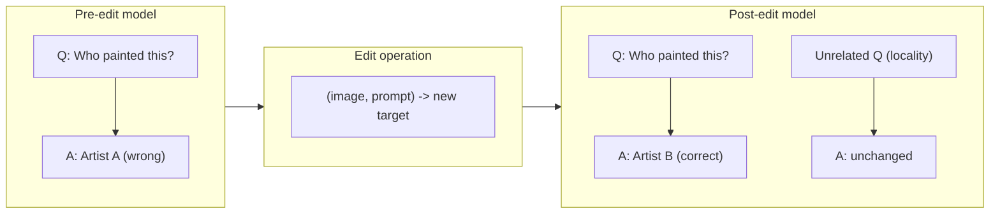
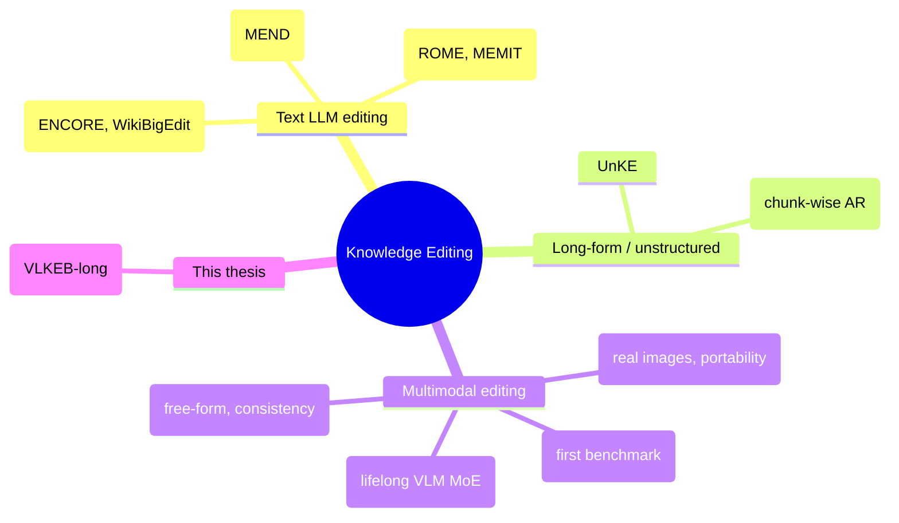
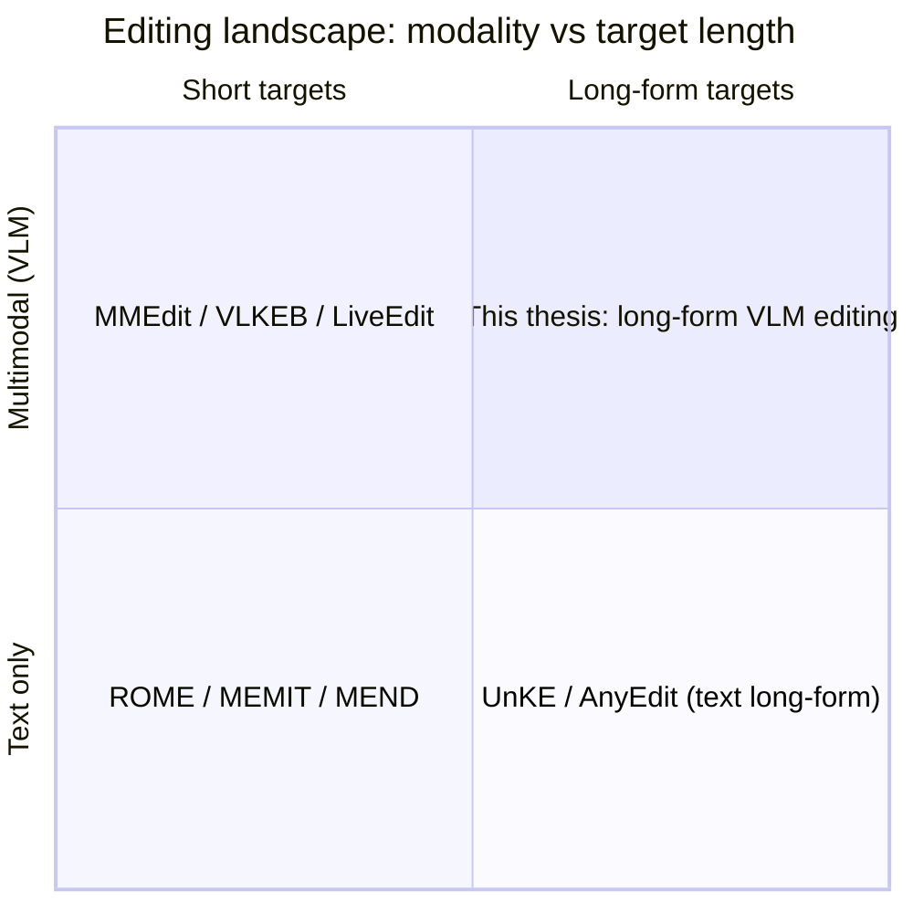
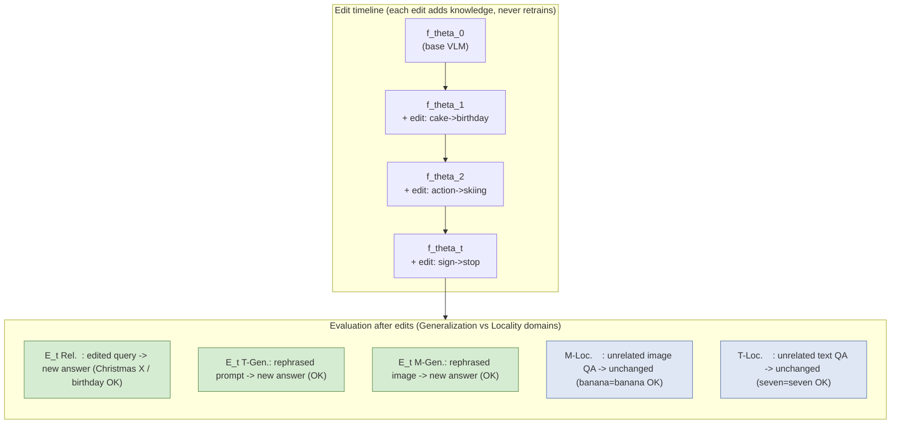
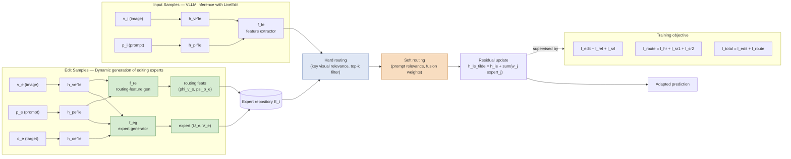
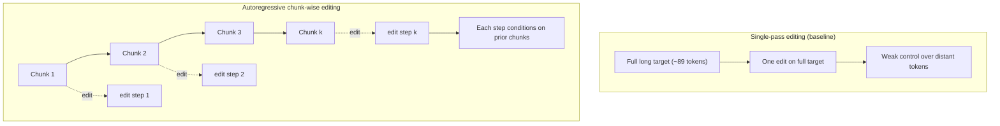
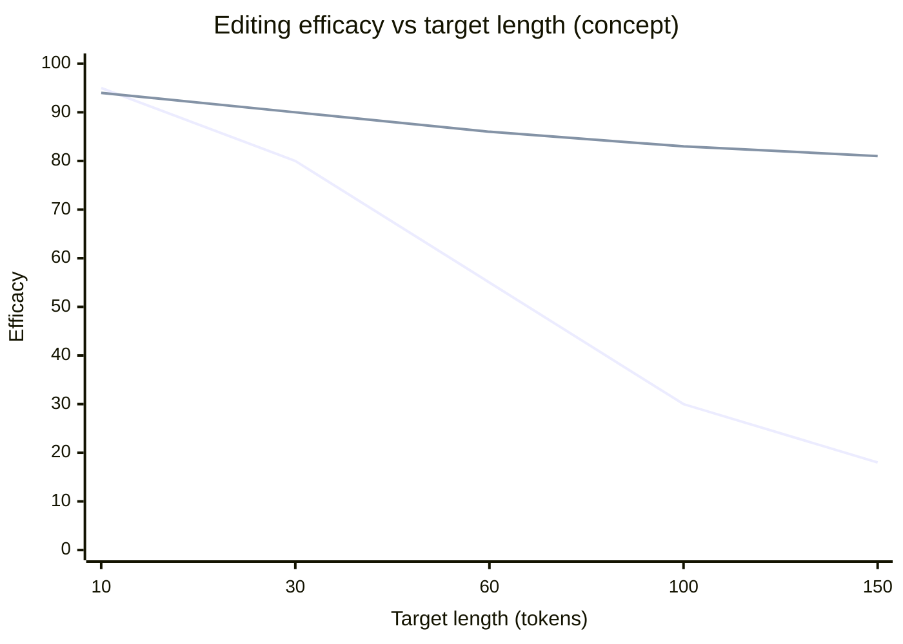
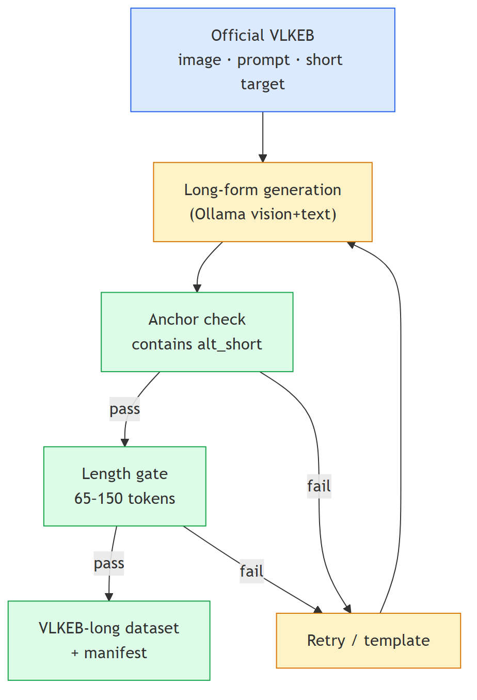
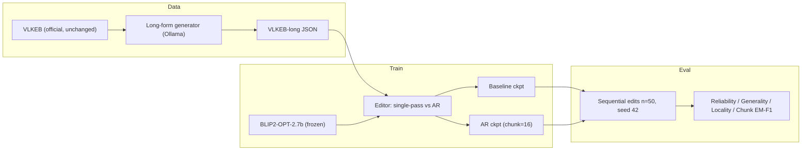
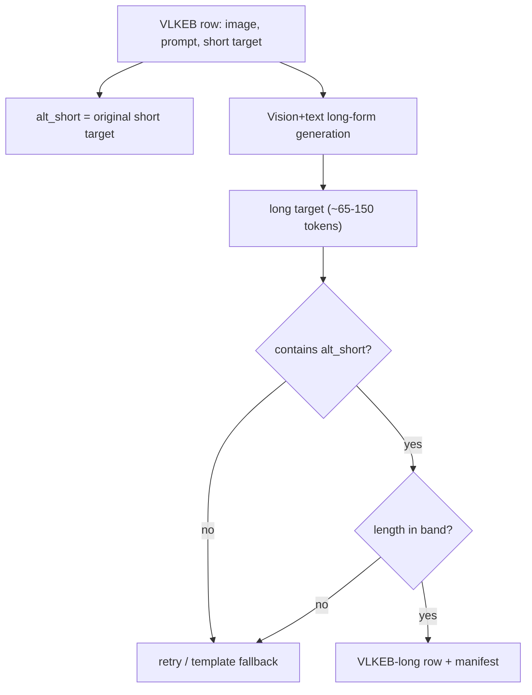

# Thesis Presentation (V5) — Long-Form Knowledge Editing for Vision–Language Models

**Title:** *Autoregressive Chunk-Wise Editing for Long-Form Knowledge in Vision–Language Models*

**Audience:** MSc thesis progress / defense · **Duration:** ~24–26 min · **Slides:** 32 + backup

> V5 changes vs V4: **Architecture broken into five major phases** — each phase has responsibilities, step tables, **Step flow (slide bullets)**, **Presenter narrative (continuous flow)**, descriptive points, and a dedicated diagram (`doc/phases/`). Slides 18–23 list the **Diagram file** path and embed the matching PNG.
>
> **Supervisor version:** formal progress report without presenter notes → `doc/THESIS_SUPERVISOR_REPORT.md` / `.docx`

---

## Slide 1 — Title

**Autoregressive Chunk-Wise Editing for Long-Form Knowledge in Vision–Language Models**

Subtitle: A study on the VLKEB-long benchmark with BLIP2-OPT-2.7b

[Your Name] · [Supervisor] · [Institution] · June 2026

---

## Slide 2 — Introduction (domain-general)

**Large models memorize facts during pre-training** — but facts go **stale, wrong, or harmful** over time (events change, errors surface, biases appear).

**Retraining is expensive and risky** (cost, carbon, overfitting, regression).

**Knowledge editing** is the lightweight alternative: change a *specific* fact while leaving everything else intact.

A good edit must satisfy three classic properties:

- **Reliability / Efficacy** — the target fact is actually updated
- **Generality** — the update holds for paraphrases / rephrasings
- **Locality / Specificity** — unrelated knowledge is preserved

**Two open frontiers** motivate this thesis (independent of any single method):

1. **Multimodality** — editing **vision–language models (VLMs)**, where image + text interact, is far less mature than text-only editing.
2. **Long-form knowledge** — real updates are often **sentences or paragraphs**, not single words; most editors are built and benchmarked for **short** targets.

---

## Slide 3 — Problem Statement (domain-general)

**Core problem:** Current knowledge-editing methods and benchmarks are dominated by **short, triplet-style targets** (e.g. *capital → city*). They do not adequately address **long-form** edits in **multimodal** models.

This creates three concrete difficulties:

1. **Efficacy degrades with length** — editing techniques that adjust a few hidden states lose influence over long outputs (tokens far from the edit point).
2. **Evaluation breaks down** — exact-match is near-zero for long answers; token-, chunk-, and semantic-level metrics are needed.
3. **Lifelong interference** — applying many edits sequentially can erode locality and earlier edits, especially when each long edit requires more updates.

**Research questions (method-agnostic):**

- **RQ1:** Can **autoregressive, chunk-wise editing** improve long-form knowledge updates in VLMs while preserving generality and locality?
- **RQ2:** How does the **granularity (chunk size)** of editing affect long-form performance?

**Scope of this thesis:** a controlled study on a long-form multimodal editing benchmark (VLKEB-long), using a representative editor and backbone.

---

## Slide 4 — Aim, Objectives & Contributions

**Aim:** Investigate whether decomposing long edit targets into chunks and editing them autoregressively benefits long-form multimodal knowledge editing.

| # | Objective | Status |
|---|-----------|--------|
| 1 | Construct a long-form multimodal editing benchmark (VLKEB-long) | Done |
| 2 | Implement chunk-wise autoregressive editing in a representative editor | Done |
| 3 | Train single-pass (baseline) vs autoregressive variants | Done |
| 4 | Full-scale evaluation (~3150 sequential edits) | Done |
| 5 | Granularity ablation (chunk size 8/16/32/64) | Done |

**Contributions:** (i) long-form multimodal benchmark + reproducible build protocol; (ii) empirical comparison of single-pass vs chunk-wise editing; (iii) granularity analysis and metric-comparability discussion.

---

## Slide 5 — Background: what is a "knowledge edit"?

An edit changes the **target response** while a **locality probe** must stay unchanged.

---

## Slide 6 — Literature Review (overview map)

---

## Slide 7 — Literature Review (1/3): Foundations & surveys

| Work | Year | Contribution | Relevance |
|------|------|-------------|-----------|
| **Knowledge Editing Survey** (Wang et al.) | 2023–24 | Formalizes editing as constrained optimization over **accuracy, locality, generality**; taxonomy: external memory / global opt / local modification | Defines the metric triple we use |
| **Pitfalls of Knowledge Editing** (survey) | 2024 | Shows editing causes **knowledge distortion** and **degraded general ability**; calls for consistent metrics | Motivates careful eval + locality focus |
| **Dual-Axis Taxonomy** | 2025 | Adds a **function-based** view (factual/temporal/conceptual/…); effectiveness depends on **knowledge type** | Long-form is a distinct, harder type |

**Takeaway:** editing is well-formalized for **short factual** knowledge; long-form and multimodal cases are flagged as **open**.

---

## Slide 8 — Literature Review (2/3): Lifelong & long-form editing

| Work | Year | Contribution | Relevance |
|------|------|-------------|-----------|
| **WikiBigEdit** | 2025 | 500K+ real Wikidata edits; tests **lifelong editing at scale** | Realistic sequential-edit pressure |
| **ENCORE — lifelong sequential editing** | 2025 | Norm-constrained edits; **10,000 sequential edits** without degradation | Locality/forgetting under many edits |
| **UnKE** | 2025 | Edits **unstructured / long** knowledge by moving beyond single-token updates | Long-form editing in text |
| **AnyEdit** (base) | 2025 | **Autoregressive chunk-wise** editing; chain-rule-of-MI motivation; long-form metrics (ROUGE-L, BERTScore) | Core mechanism we adapt to VLMs |

**Takeaway:** chunk-wise / autoregressive editing solves the **length** problem **in text**; not yet studied for **vision–language** models.

---

## Slide 9 — Literature Review (3/3): Multimodal editing & benchmarks

| Work | Year | Contribution | Relevance |
|------|------|-------------|-----------|
| **MMEdit** | 2023 | First multimodal editing benchmark (VQA + caption) | Origin of multimodal editing eval |
| **VLKEB** | 2024 | **Real images** via multimodal KG; adds **Portability**; harder locality | Our base benchmark (short targets) |
| **MMKE-Bench** | ICLR 2025 | **Free-form** visual knowledge; entity/semantic/user edits | Argues for natural-language (long) edits |
| **MC-MKE** | ACL 2025 | Fine-grained edits emphasizing **modality consistency** | Motivates careful multimodal metrics |
| **LiveEdit** (base) | CVPR 2025 | **Lifelong VLM editing** via low-rank **mixture-of-experts** + routing | Editor we build on |

**Gap identified:** No prior work studies **long-form** targets in a **lifelong VLM** editing setting — this thesis fills that gap (VLKEB-long + chunk-wise AR).

---

## Slide 10 — Research Gap (positioning)

The **upper-right** quadrant — long-form + multimodal — is under-explored.

---

## Slide 11 — Concept Diagram (LiveEdit Fig. 1 style): Lifelong VLM editing

> Recreates LiveEdit Figure 1: a timeline of edits `f_θ0 → f_θ1 → … → f_θt`, where after each edit the model is checked on Reliability, Generality (T-/M-Gen), and Locality (T-/M-Loc). Pre-edit answers are wrong (✗); post-edit answers become correct (✓) while locality stays unchanged.

**Key idea:** across many sequential edits, the model must answer **edited + related (generalization domain)** queries correctly while keeping **unrelated (locality domain)** answers unchanged.

---

## Slide 12 — Architecture Diagram (LiveEdit Fig. 2 style): MoE editor

> Recreates LiveEdit Figure 2. **Top stream** = editing: edit sample `(v_e, p_e, o_e)` → layer-`l_e` hidden states → expert generator `f_eg` produces a low-rank expert `(U_e, V_e)` and routing features `(φ̂_ve, ψ̂_pe)` via `f_re`, both stored in expert repository `E_t`. **Bottom stream** = inference: input `(v_i, p_i)` → `f_fe` extracts features → **hard routing** (key visual relevance, top-k) → **soft routing** (prompt relevance, fusion weights) → residual update of the representation.

**Legend (as in the paper):** green = dynamic expert generation · blue = hard routing via key visual relevance · orange = soft routing via prompt relevance. **The editor is external** to the frozen VLM and experts accumulate per edit (lifelong).

---

## Slide 13 — Mechanism Diagram (AnyEdit Fig. 1 style): single-pass vs autoregressive

> Recreates the **single-token vs autoregressive chunk editing** contrast and the **efficacy-vs-length** intuition.

**Diagram file:** `results/results_efficacy_vs_length.png`

**What this chart shows:** Conceptual motivation — as edit targets grow longer, a **single full-target edit** (gray) loses control, while **autoregressive chunk editing** (amber) keeps efficacy high. This is why we chunk ~89-token VLKEB-long answers rather than editing them in one pass.

---

## Slide 14 — Methodology (math): formal edit problem

**What to say:** We treat each edit as a multimodal fact update — not retraining the whole model, but injecting one new long answer for one (image, question) pair.

**Notation.** Let the frozen VLM be **f**_θ. An edit request is a tuple:

    e = (v, p, y^*)

where **v** = image, **p** = text prompt, and target y^* is the desired long-form answer (**L** tokens).

**Edited model.** External editor **E** updates editor state after each edit; VLM weights stay frozen:

    f_{θ_t} = E(f_{θ_{t-1}}, e_t)          θ_t = θ_{t-1}   (VLM frozen)

**Descriptive points:**

- The **VLM backbone stays frozen** — all learning happens in the external LiveEdit editor (MoE experts + routing).
- Each lifelong edit adds state to the editor repository; we never fine-tune BLIP2 weights on the full benchmark.
- Success is measured on **three probe types**, not just “did the edited answer change?”

**Three evaluation domains** (LiveEdit / VLKEB protocol):

| Domain | Query | Requirement |
|--------|-------|-------------|
| **Reliability** | (v, p) | ŷ = y^* |
| **Generality** | (v′, p′) rephrased | ŷ = y^* |
| **Locality** | unrelated (v_ℓ, p_ℓ) | ŷ_ℓ = y_ℓ^{pre} |

- **Reliability** — the edited model must produce the new long target on the original image + prompt.
- **Generality** — the same fact must hold when the **prompt is rephrased** or the **image is swapped** for a related view.
- **Locality** — answers to **unrelated** text/image questions must stay identical to pre-edit behaviour.

**Objective (informal).** Maximize reliability and generality while limiting locality drift under sequential edits e₁, e₂, …, e_T.

---

## Slide 15 — Methodology (math): chunk decomposition & AR loop

**What to say:** Long answers (~89 tokens) are hard to edit in one shot; we split the target into chunks and apply edits autoregressively, building up the answer piece by piece.

**Token chunking** (chunk size **s**, default **s = 16**). Tokenize target y^* into token IDs and partition:

    y^* = Dec(c₁ ‖ c₂ ‖ … ‖ c_K),     |c_k| ≤ s

Implementation: `split_target_into_chunks(tokenizer, y^*, s)`.

**Descriptive points:**

- Chunking is **token-based** (BLIP2 tokenizer), not sentence-based — consistent with the editor’s token-level loss.
- Default **s = 16** balances edit granularity vs number of expert inserts per sample.
- Each chunk is a contiguous token block; the full long target is the concatenation of all chunks.

**Single-pass baseline** — one expert per request on the **full** target:

    E_{SP}(e):   E_t ← E_{t−1} ∪ { (U_e, V_e, φ̂_v, ψ̂_p) }

- Baseline stores **one** low-rank expert per edit, trained to predict the **entire** long target at once.
- This mirrors original LiveEdit but on VLKEB-long targets — our control condition.

**Autoregressive chunk-wise edit** — for k = 1, …, K, define the **prefix target**:

    y_k = Dec(c₁, …, c_k)

Append one expert per step (chunk index **k** stored for routing):

    E_{AR}(e):   for k = 1..K:   E_t ← E_{t−1} ∪ Expert(v, p, y_k)

- At step **k**, the edit target is the **prefix** up to chunk k — the model is trained to “know” progressively more of the answer.
- Each step adds a **separate expert** tagged with chunk index **k** for chunk-aware routing at inference.
- If chunking fails, the code **falls back** to single-pass editing on the full target.

**Theoretical motivation** (AnyEdit / MI chain rule; frozen image prefix **V**):

    I(X, V ; Y | h′₁, …, h′_K)  =  Σ_{k=1..K}  I(X, V, Y_{<k} ; Y_k | h′_k)

- AnyEdit shows long-form text editing improves when conditioned on **prior chunks**; we extend this idea to VLMs.
- Because the **image encoder is frozen**, visual context **V** acts as a fixed prefix — the decomposition still applies.

Long targets decompose into **conditionally independent sub-problems** per chunk, improving control over distant tokens.

---

## Slide 16 — Methodology (math): MoE residual update & training loss

**What to say:** LiveEdit learns small low-rank “expert” patches applied to hidden states; training jointly optimizes edit quality, generality, locality, and routing.

**Low-rank expert** at edit layer **ℓ_e**. Hidden states **h^ℓ ∈ ℝ^{L×d}**, retrieved experts **(U_j, V_j)**, fusion weights **w_j**:

    h̃^{ℓ}  =  h^{ℓ}  +  Σ_{j∈R}  w_j · Expert_j(h^{ℓ})

    Expert_j(h)  =  ReLU(h · U_j) · V_j

    w_j  =  softmax(sim_j)  ⊙  σ(sim_j)

where **sim_j = (1/√d_m) · ⟨ψ_i, φ_j⟩** (soft routing); hard routing keeps experts with **sim^{vis}_j > sim^{prot}**.

**Descriptive points:**

- **Hard routing** (visual): retrieve experts whose stored image features match the current input image.
- **Soft routing** (text): weight experts by prompt similarity — fuse multiple experts when several edits are relevant.
- The edit is a **residual** added at one mid-layer — the VLM forward pass otherwise unchanged.

**Training loss** (LiveEdit editor modules only; VLM frozen):

    L_{total} = λ_{rel}·L_{rel} + λ_{gen}·L_{gen} + λ_{loc}·L_{loc} + λ_{sr}·L_{sr} + λ_{hr}·L_{hr}

- **Reliability** (masked NLL):  L_{rel} = −(1/|M|) · Σ_{i∈M} log p_θ(y_i | v, p, y_{<i})
  - Teaches the editor to predict the **new target tokens** on the edited (image, prompt).
- **AR variant:**  L_{rel} = (1/K) · Σ_k L_{rel}^{(k)}  over token positions in chunk c_k
  - AR averages **per-chunk** NLL — each chunk’s tokens supervised separately within one forward pass.
- **Generality:** same NLL on rephrased (v′, p′) probes
  - Ensures the edit survives **paraphrased** text and **rephrased** images.
- **Locality:**  L_{loc} = KL(p_{pre} ‖ p_{edit})  on unrelated probes
  - Penalizes logit drift on locality questions — keeps unrelated answers stable.
- **Routing:** contrastive NLL on hard (visual) and soft (textual) neighbor/prototype pairs
  - Trains the router to pick the **right expert** and ignore irrelevant ones in the pool.

**Training setup:** 20 epochs on VLKEB-long train split; BLIP2-OPT-2.7b frozen; only editor modules updated.

---

## Slide 17 — Methodology (math): evaluation metrics

**What to say:** Standard exact match fails on ~89-token answers; we report token-level and chunk-level metrics under a fixed lifelong eval protocol.

**Token accuracy** (reliability / generality):

    Acc = (1/N) · Σ_i  1[y_i = ŷ_i]     over masked target tokens

- Primary **reliability** score: fraction of target tokens predicted correctly after editing.
- Same metric applied to **text-** and **image-generality** probes.

**Exact match (EM):**  EM = 1[y^* = ŷ]  — expected **≈ 0** when **L ≈ 89**.

- Verbatim string match is **too strict** for long-form outputs — included for completeness, not as headline result.

**Chunk EM & Chunk F1** (chunk size **s**, aligned windows [start, start+s)):

    Chunk-EM = (1/|C|) · Σ_c  1[ŷ_c = y_c]

    Chunk-F1_c = (Σ_i  1[ŷ_i = y_i] · m_i) / (Σ_i m_i)

    Chunk-F1 = (1/|C|) · Σ_c  Chunk-F1_c

- **Chunk EM** — fraction of token windows where **every** token in the window is correct (AnyEdit-style segment match).
- **Chunk F1** — average per-window token overlap; more forgiving than chunk EM, still length-aware.
- Both use **s = 16** at eval unless ablating chunk size (Slide 27).

*Note:* Chunk EM is **not comparable across chunk sizes** (different window count).

**Locality accuracy:** fraction of locality probes where edited model matches pre-edit answer.

- Reported separately for **text** and **image** locality probes from VLKEB.

**Lifelong protocol:** sequential batches of **n = 50** edits, seed 42, **T ≈ 3150** total edits on VLKEB-long eval.

- Edits applied **sequentially** — later edits see the full expert pool from earlier edits (lifelong stress test).
- Fixed **seed 42** for reproducibility; same protocol for baseline and AR checkpoints.

---

## Slide 18 — Methodology: architecture — five phases (overview)

**What to say:** The thesis is not one monolithic model — it is a pipeline of five phases. Each phase has a single job: prepare data, plan chunks, store edits, apply edits at inference, then measure outcomes.

**Diagram file:** `phases/phases_overview.png`

| Phase | Name | Primary responsibility | Main output |
|-------|------|------------------------|-------------|
| **1** | Data & benchmark | Build VLKEB-long from official VLKEB | Long-form JSON + quality manifest |
| **2** | Chunk planning | Split targets & schedule AR prefix edits | Chunks c₁…c_K and edit steps k=1..K |
| **3** | Expert pool | Generate & store LiveEdit MoE experts | Growing repository E_t with routing keys |
| **4** | Routed inference | Retrieve experts & update frozen BLIP2 | Long-form prediction ŷ at query time |
| **5** | Train & evaluate | Fit editor + run lifelong benchmark | Baseline vs AR metrics & checkpoints |

**Step flow (slide bullets):**

- Phase 1: official VLKEB → elongate targets → **VLKEB-long**
- Phase 2: split long answers into **chunks** → schedule prefix edits
- Phase 3: mint **experts** → append to lifelong pool E_t
- Phase 4: **route** experts at inference → residual update on frozen BLIP2
- Phase 5: **train** editor → **evaluate** baseline vs AR on same protocol

**Presenter narrative (continuous flow):**

The pipeline begins by taking the official **VLKEB benchmark** and extending only the edit targets into **VLKEB-long**, so every image, prompt, and probe stays comparable to prior work. Each long answer then passes through **chunk planning**, where it is split and scheduled for autoregressive prefix edits. For every scheduled step, the system **mints a new expert** and adds it to a growing pool rather than changing VLM weights. When a query arrives at inference time, the model **routes to the right experts** and applies a lightweight residual update on top of the frozen BLIP2 backbone. Finally, we **train the editor** on the long-form train split and **evaluate both variants**—baseline and autoregressive—under the same lifelong protocol to see whether chunk-wise editing actually helps.

**How the phases connect:**

Each VLKEB-long row from Phase 1 flows into Phase 2, where its long target is decomposed into chunks and an edit schedule. Every step on that schedule triggers Phase 3 to add another expert to the pool, and at inference time Phase 4 retrieves from that pool to steer the frozen VLM. Phase 5 then trains the components that Phases 3–4 rely on and measures whether the full pipeline delivers better long-form editing without breaking locality.

**Design principle:** Phases **1–2** decide *what* to edit; **3–4** decide *how* the edit is stored and applied; **5** decides *whether* the approach works. The VLM backbone is touched only in Phases **4** (inference hook) and **5** (frozen during training).

---

## Slide 19 — Phase 1: Data & benchmark (VLKEB-long)

**What to say:** Before we can test long-form editing, we need a benchmark where answers are genuinely long — but still tied to the same multimodal probes VLKEB already defines.

**Responsibility:** Extend VLKEB with long-form edit targets **without** changing images, prompts, generality rephrases, or locality probes.

**Diagram file:** `phases/phase1_data_construction.png` *(same flow as Slide 25, phase-themed colours)*

*Previous compact pipeline diagram (kept):* `phases/phase1_data.png`

| Step | Action | Detail | Output |
|------|--------|--------|--------|
| 1.1 | Load official VLKEB row | Keep image path, question, short `alt`, rephrase & locality fields | (v, p, alt_short) |
| 1.2 | Long-form generation | Ollama vision+text model expands short fact into a paragraph | draft y^* (~65–150 tok) |
| 1.3 | Anchor check | Reject if draft does not **contain** original short string | pass / retry |
| 1.4 | Length gate | Enforce token band; discard too-short or runaway outputs | pass / retry |
| 1.5 | Publish | Write row to JSON + log pass/fail in manifest | VLKEB-long split |

**Step flow (slide bullets):**

- Load official **VLKEB row** (image, question, short answer) unchanged
- **Generate** a longer paragraph with Ollama vision+text model
- **Verify anchor:** long text must contain the original short fact
- **Verify length:** target must fall in the 65–150 token band
- **Save** passing rows to VLKEB-long + manifest; **retry** on failure

**Presenter narrative (continuous flow):**

We start from an official **VLKEB row**—the same image, question, and short answer used in prior multimodal editing work—and ask a vision+text model to **expand the short fact into a paragraph-length answer**. Before accepting that draft, we verify that the long text **still contains the original short string**, so the elongated answer cannot drift to an unrelated fact. We then check that the answer falls in a **valid length band** (roughly 65–150 tokens); if either check fails, we regenerate until it passes or fall back to a template. Only then do we **publish the row** into VLKEB-long, together with a manifest that records which quality gates each sample satisfied.

**Descriptive points:**

- **What stays the same:** all images, prompts, text/image generality pairs, and text/image locality questions — only the **edit target** grows longer.
- **Why anchor?** Guarantees the long answer still expresses the **same core fact** as the original VLKEB short target (lexical tie, not human re-annotation).
- **Scale:** 3174 eval rows built; **3150** used in full sequential eval; mean target length **~89 tokens** (vs a few tokens in original VLKEB).
- **Honest limit:** anchoring is **lexical**, not a guarantee that every clause in the long answer is visually grounded — stated explicitly in the thesis.

**Phase 1 output feeds:** Phase 2 (chunking) and Phase 5 (train/eval splits).

---

## Slide 20 — Phase 2: Chunk planning & AR scheduling

**What to say:** A ~89-token target is too long for a single edit to control reliably — so we break it into chunks and edit prefix-by-prefix, autoregressively.

**Responsibility:** Decompose each long target into token chunks and define **when** and **on what prefix** each edit is applied.

**Diagram file:** `phases/phase2_chunk_ar.png`

| Step | Action | Detail | Output |
|------|--------|--------|--------|
| 2.1 | Tokenize y^* | BLIP2 tokenizer, no special tokens | token ID list |
| 2.2 | Split chunks | Fixed size **s = 16** tokens per chunk (default) | c₁, c₂, …, c_K |
| 2.3 | Build prefix | Decode cumulative chunks: y_k = Dec(c₁…c_k) | progressive targets |
| 2.4 | Schedule edits | For k = 1..K, queue one edit on (v, p, y_k) | K edit steps per sample |

**Step flow (slide bullets):**

- **Tokenize** long target y^* with BLIP2 tokenizer
- **Split** into fixed 16-token chunks → c₁, c₂, …, c_K
- **Build prefix** y_k = text of chunks 1 through k
- **Schedule one edit** per prefix: (image, prompt, y_k)
- Hand each step to **Phase 3** to create one expert per chunk

**Presenter narrative (continuous flow):**

Given a long target y^*, we first **tokenize it** with the same BLIP2 tokenizer used at train and test time, then **slice the token stream into fixed windows** of 16 tokens to obtain chunks c₁ through c_K. Rather than editing the full answer in one shot, we walk forward chunk by chunk: at step k we **reconstruct the prefix** y_k consisting of all chunks up to k, and we **schedule one edit** on the triple (image, prompt, y_k). That autoregressive schedule means each edit always builds on what came before—chunk 2 is edited knowing chunk 1 is already in place—and each scheduled step is handed off to Phase 3 to create its own expert.

**Descriptive points:**

- **Why token chunks?** The editor loss and generation are token-level; chunk size aligns with AnyEdit-style windows and our chunk EM metric.
- **Autoregressive meaning:** edit step k supervises only the **new** chunk tokens while the prefix provides context — analogous to training on partial sequences.
- **Chunk index k** is stored with each expert (Phase 3) so inference can gate retrieval to the right segment (Phase 4).
- **Fallback:** if chunking fails (empty target, tokenizer edge case), the system falls back to **single-pass** edit on full y^*.

**Baseline contrast:** single-pass baseline runs **one** edit on the full y^* — skips steps 2.3–2.4 scheduling entirely.

**Phase 2 output feeds:** Phase 3 (one expert per scheduled step) and Phase 5 (chunk-size ablation at s ∈ {8, 16, 32, 64}).

---

## Slide 21 — Phase 3: Expert generation & lifelong pool

**What to say:** Each edit does not change BLIP2 weights — instead we mint a small “expert” module and save it in a pool that grows over the edit stream.

**Responsibility:** For every edit step, encode the multimodal edit sample, generate a low-rank expert + routing features, and append to repository **E_t**.

**Diagram file:** `phases/phase3_expert_pool.png`

| Step | Action | Detail | Output |
|------|--------|--------|--------|
| 3.1 | Encode sample | Forward (v, p, y_k) through frozen BLIP2; read reps at edit layer ℓ_e | vision, query, answer hidden states |
| 3.2 | Expert generator f_eg | Low-rank adapter matrices from concatenated edit reps | (U_k, V_k) expert weights |
| 3.3 | Routing gen f_re | Extract visual & prompt keys for later retrieval | (φ̂_v, ψ̂_p) routing features |
| 3.4 | Append to pool | Store expert + keys; tag with chunk index k (AR) or −1 (baseline) | E_t grows by one entry |

**Step flow (slide bullets):**

- Forward **(image, prompt, prefix y_k)** through frozen BLIP2
- Read **hidden states** at edit layer ℓ_e
- **Generate** low-rank expert (U_k, V_k) via f_eg
- **Extract routing keys** (φ̂_v, ψ̂_p) via f_re
- **Append** expert + keys + chunk tag to pool E_t

**Presenter narrative (continuous flow):**

For each edit step scheduled in Phase 2, we run the multimodal sample **(image, prompt, prefix target y_k)** through the **frozen BLIP2 model** and read off hidden representations at the edit layer for the vision, prompt, and answer tokens. From those representations the **expert generator** produces a compact low-rank module (U_k, V_k), while the **routing module** extracts visual and textual keys that will later identify when this edit should fire. We then **append the expert together with its keys and chunk tag** to the lifelong repository E_t. The VLM weights themselves are never overwritten—each new edit simply adds another retrievable module to the pool.

**Descriptive points:**

- **External editing:** BLIP2-OPT-2.7b weights are **never** updated — only the editor modules (f_eg, f_re, routers) are trained.
- **Lifelong property:** experts **accumulate** across sequential edits; later queries may retrieve multiple past experts via routing.
- **AR vs baseline:** AR adds **K experts per long edit** (one per chunk); baseline adds **one expert per edit** on the full target.
- **Memory implication:** longer targets → more chunks → larger pool per sample — relevant under sequential eval (n=50 edits per batch).

**Phase 3 output feeds:** Phase 4 (expert pool queried at inference) and Phase 5 (training optimizes f_eg, f_re, and routers).

---

## Slide 22 — Phase 4: Routed inference on frozen BLIP2

**What to say:** When the user asks a question with an image, the system finds the right stored experts and nudges the VLM’s internal representation — then decoding continues as normal.

**Responsibility:** At query time, retrieve relevant experts from E_t and inject a **residual update** into hidden states at edit layer ℓ_e of the frozen VLM.

**Diagram file:** `phases/phase4_routed_inference.png`

| Step | Action | Detail | Output |
|------|--------|--------|--------|
| 4.1 | VLM forward | Run BLIP2 on query (v_i, p_i); capture h^ℓ at hooked layer | base hidden states |
| 4.2 | Hard routing | Compare input image to stored φ̂_v; keep visually relevant experts | candidate subset |
| 4.3 | Soft routing | Weight candidates by prompt similarity ψ̂_p; produce fusion weights w_j | weighted expert set |
| 4.4 | Chunk gate (AR) | When decoding chunk k, restrict pool to experts tagged with index k | chunk-aligned experts |
| 4.5 | Residual update | h̃^ℓ = h^ℓ + Σ_j w_j · Expert_j(h^ℓ) | edited representation |
| 4.6 | Decode | Resume VLM layers above ℓ_e; generate token sequence | long-form ŷ |

**Step flow (slide bullets):**

- Run query **(image, prompt)** through BLIP2 → hidden states h^ℓ
- **Hard route:** keep experts with matching visual key
- **Soft route:** weight experts by prompt similarity
- **Chunk gate (AR):** restrict to experts tagged for chunk k
- **Apply residual update** → continue decode → long-form **ŷ**

**Presenter narrative (continuous flow):**

When a user submits a new **(image, prompt)** pair, BLIP2 runs forward until the hooked edit layer, giving us the base hidden states h^ℓ. We then search the expert pool: **hard routing** keeps only experts whose stored visual key matches the current scene, and **soft routing** reweights the survivors by prompt similarity so the most relevant edits dominate. In autoregressive mode, a **chunk gate** further restricts retrieval to experts tagged for the chunk currently being decoded. The selected experts are fused into a **residual update** that is added to h^ℓ, after which the VLM continues its normal upper layers and produces the **long-form answer** ŷ—without any change to the underlying backbone weights.

**Descriptive points:**

- **Two-stage routing mirrors LiveEdit:** hard = “is this the same visual situation?” · soft = “is this the same question wording?”
- **Chunk gate (AR-only):** prevents a chunk-3 expert from firing when generating chunk-1 tokens — aligns inference with AR training structure.
- **Non-destructive edit:** if no expert matches, routing can fall back to base VLM behaviour (prototype threshold in hard routing).
- **Where editing happens:** single mid-layer hook — minimal intrusion into the 2.7B-parameter forward pass.

**Phase 4 output feeds:** Phase 5 (reliability / generality / locality probes all run through this inference path).

---

## Slide 23 — Phase 5: Training objectives & evaluation

**What to say:** We train only the editor, then stress-test both variants on the same long-form benchmark with thousands of sequential edits.

**Responsibility:** Fit editor parameters on VLKEB-long train split; evaluate baseline vs AR under an identical **lifelong** protocol with long-form-aware metrics.

**Diagram file:** `phases/phase5_train_eval.png`

| Step | Action | Detail | Output |
|------|--------|--------|--------|
| 5.1 | Train editor | 20 epochs; BLIP2 frozen; optimize L_total on train split | baseline & AR checkpoints |
| 5.2 | Sequential editing | Apply edits in batches of **50**; pool grows across stream | edited model state E_t |
| 5.3 | Probe evaluation | After edits: reliability, text/image generality, text/image locality | per-probe accuracy |
| 5.4 | Long-form metrics | Token accuracy + chunk EM/F1 (s=16); EM reported but expected ≈ 0 | thesis result tables |

**Step flow (slide bullets):**

- **Train** editor only (20 epochs); BLIP2 stays frozen
- Save **baseline** and **AR** checkpoints
- Run **~3150 sequential edits** (batches of 50, seed 42)
- Score **reliability, generality, locality** probes
- Report **token acc** + **chunk EM/F1**; compare baseline vs AR

**Presenter narrative (continuous flow):**

We first **train only the editor modules** for 20 epochs on the VLKEB-long train split while keeping BLIP2 frozen, optimizing a combined loss that encourages correct edits, stable locality, and reliable routing. This yields two checkpoints—the **single-pass baseline** and the **autoregressive variant**—that differ in only one design choice: how edits are scheduled during training. We then run both models through the **same eval protocol**, applying roughly 3150 edits sequentially in batches of 50 so the expert pool grows under realistic lifelong pressure. After each edit stream we probe the model on **reliability, generality, and locality** questions, and we summarize long-form performance with **token accuracy and chunk-level EM/F1**, which are far more informative than exact match for ~89-token targets.

**Training loss breakdown:**

- **L_rel** — predict edited target tokens (AR: averaged per-chunk NLL).
- **L_gen** — same on rephrased prompt/image probes (generality).
- **L_loc** — KL penalty keeping unrelated probe logits near pre-edit (locality).
- **L_route** — contrastive routing losses so the right expert is retrieved later (Phase 4).

**Evaluation protocol (fixed for both models):**

- Seed **42** · **~3150** edits · mean target **~89 tokens** · predominantly **65+ token** bin.
- **Controlled variable:** single-pass vs AR chunk editing — everything else matched.

**Phase 5 deliverables:** comparison JSON (`eval_results/comparison/`), thesis Tables 1–2, validation flags (long-form gain ✓, locality bounded ✓).

---

## Slide 24 — Methodology: overall pipeline

**What to say:** Three stages — build the long-form benchmark, train two editor variants, evaluate under identical lifelong conditions.

**Descriptive points:**

| Stage | What happens | Why it matters |
|-------|----------------|----------------|
| **Data** | Official VLKEB images/prompts kept; only targets elongated via Ollama | Isolates the **long-form** variable without changing multimodal structure |
| **Train** | Same backbone + same train split; only difference is **single-pass vs AR** editing | Fair comparison — one controlled mechanism change |
| **Eval** | Both checkpoints run on full VLKEB-long eval with **3150 sequential edits** | Tests long-form gains **and** lifelong stability on the same benchmark |

- **Controlled comparison:** identical data, backbone, training budget; only the edit mechanism differs.
- **Two checkpoints:** baseline (full-target edit) vs AR (chunk size 16 at train and default eval).
- **Outputs:** JSON result artifacts under `eval_results/comparison/` for thesis tables.

---

## Slide 25 — Methodology: VLKEB-long construction

**What to say:** We extend VLKEB by elongating edit targets while anchoring each long answer to the original short fact — reproducible, automated, with explicit quality gates.

**Descriptive points:**

- **Inputs preserved:** same image files, prompts, generality rephrases, and locality probes as official VLKEB.
- **Generation:** Ollama vision+text model produces a **paragraph-length** answer given image + question + short fact.
- **Anchoring gate:** long target must **contain** the original short string `alt_short` — ties long text to the verified short fact.
- **Length gate:** target must fall in **~65–150 tokens** — excludes too-short or runaway generations.
- **Retry / fallback:** failed rows re-prompted or filled from template so the benchmark stays complete.

- Official data/images **unchanged**; only the target is elongated and **anchored** to the original.
- **3174** eval rows; **3150** edits used; mean length **~89 tokens**.
- Honest limit: **lexical anchoring**, not full visual grounding of every clause — long text may add detail beyond what is visually verified.

**Reproducibility:** construction script + manifest document row-level pass/fail for each quality gate.

---

## Slide 26 — Results: single-pass vs autoregressive

**What to say:** Both models were trained on VLKEB-long for 20 epochs and evaluated under the same lifelong protocol (3150 edits, seed 42, mean target ~89 tokens). AR improves every reliability and generality metric slightly while locality stays perfect.

**Primary comparison** — long-trained baseline vs AR (chunk size 16, matches training):

| Metric | Baseline | AR (cs=16) | Δ |
|--------|----------|------------|---|
| Reliability acc | 75.40% | 75.94% | +0.54 pp |
| Chunk EM | 13.50% | 14.82% | +1.32 pp |
| Chunk F1 | 76.28% | 76.90% | +0.62 pp |
| Text generality | 75.21% | 75.63% | +0.42 pp |
| Image generality | 71.49% | 72.51% | +1.02 pp |
| Locality (text/image) | 100%/100% | 100%/100% | 0 |
| Exact match | 0% | 0% | — |

**What each metric means:**

| Metric | Brief explanation |
|--------|-------------------|
| **Reliability acc** | Token-level accuracy on the original (image, prompt) after the edit — main long-form success rate |
| **Chunk EM** | Share of 16-token windows that match the target exactly — segment-level strictness |
| **Chunk F1** | Token overlap F1 within chunk windows — softer segment match |
| **Text / image generality** | Same edited fact holds on rephrased prompt or swapped image |
| **Locality (text/image)** | Unrelated text/image probes unchanged from pre-edit behaviour |
| **Exact match (EM)** | Full answer string identical to target — ~0% expected at ~89 tokens |
| **Δ (pp)** | AR minus baseline in **percentage points** (not relative %) |

**Reading the table:** Gains are modest but **consistent** (+0.5–1.3 pp). The largest relative lift is **chunk EM** (+1.32 pp), which aligns with the AR hypothesis that chunk-wise editing helps segment-level control. **EM = 0%** for both is expected — do not use it as the headline metric on VLKEB-long.

**Motivation (concept):** single-pass editing loses control as targets grow; AR chunk editing is designed to stay effective at ~89 tokens.

**Diagram file:** `results/results_efficacy_vs_length.png`

**What this chart shows:** Same concept as Slide 13 — long targets punish single-pass editing; AR chunk editing is designed to remain effective at ~89 tokens.

**Diagram file:** `results/results_baseline_vs_ar.png`

**What this chart shows:** Side-by-side scores on VLKEB-long (blue = long baseline, amber = AR cs=16). AR wins on every metric; the clearest gap is **chunk EM** (13.5% → 14.8%), supporting segment-wise editing.

**Diagram file:** `results/results_ar_delta.png`

**What this chart shows:** Absolute **AR − baseline** gain in percentage points. Improvements are small (+0.4 to +1.3 pp) but consistent — chunk EM shows the largest lift.

**Validation:** long-form improvement ✓ · locality bounded ✓ · n=3150, seed 42 · source: `eval_results/comparison/liveedit_vs_ar_seed42_longform.json`

---

## Slide 27 — Results: long-form training effect

**What to say:** Before comparing AR to baseline, we must show that **long-form training** is essential. A short-target editor collapses on VLKEB-long even though it works on original VLKEB.

**Cross-eval on VLKEB-long** (same eval split, different checkpoints):

| Run | Rel acc | Chunk EM | Chunk F1 | Text gen | Image gen | Locality | Mean tokens |
|-----|---------|----------|----------|----------|-----------|----------|-------------|
| Short-trained → **short eval** (VLKEB) | **95.53%** | 85.14% | 95.53% | 95.34% | 91.72% | 100% | **3.7** |
| Short-trained → **long eval** | **28.57%** | 1.68% | 30.62% | 28.79% | 28.85% | 100% | **88.6** |
| Long-trained baseline → long eval | **75.40%** | 13.50% | 76.28% | 75.21% | 71.49% | 100% | **88.6** |
| Long-trained AR (cs=16) → long eval | **75.94%** | 14.82% | 76.90% | 75.63% | 72.51% | 100% | **88.6** |

**What this table shows:**

- **Short-trained on long eval** drops to **28.6%** reliability (−46.8 pp vs long baseline) — the editor was never trained on paragraph-length targets.
- **Retraining on VLKEB-long** restores **75.4%** — the benchmark extension + training matter more than AR alone.
- **Locality stays 100%** even when reliability fails — unrelated knowledge is preserved, but the edit target is not satisfied.
- **AR (+0.54 pp)** is a second, smaller effect on top of long-form training — separate these two claims in the thesis narrative.

**Diagram file:** `results/results_training_effect.png`

**What this chart shows:** The dominant effect is **training data**, not AR. A short-trained editor scores **28.6%** on long eval (brown); retraining on VLKEB-long restores **75.4%** (blue). AR adds only **+0.5 pp** on top (amber).

---

## Slide 28 — Results: granularity (chunk size) ablation

**What to say:** We vary only inference chunk size (8 / 16 / 32 / 64) using the **same** AR checkpoint trained with cs=16. Token-level metrics are flat; chunk EM changes with window size.

**Inference chunk-size sweep** (long-trained AR checkpoint, VLKEB-long eval):

| chunk_size | Rel acc | Chunk EM | Chunk F1 | Locality |
|------------|---------|----------|----------|----------|
| 8 | 75.94% | 26.26% | 76.48% | 100% |
| **16** | **75.94%** | **14.82%** | **76.90%** | **100%** |
| 32 | 75.94% | 8.11% | 77.30% | 100% |
| 64 | 75.94% | 6.14% | 77.88% | 100% |

**What each column means here:**

| Column | Brief explanation |
|--------|-------------------|
| **chunk_size** | Inference window for AR routing and chunk scoring — **not** retraining |
| **Rel acc** | Unchanged at 75.94% → inference granularity alone does not move token accuracy |
| **Chunk EM** | Exact match within windows of size `chunk_size` — **not comparable across rows** |
| **Chunk F1** | Overlap F1 within those windows — rises slightly with larger windows (metric effect) |
| **Locality** | 100% for all sizes — no trade-off observed |

**How to interpret:**

- Token accuracy, generality, and locality are **identical** across all four chunk sizes.
- **cs=16** is the thesis default — matches training and enables fair comparison to the long baseline.
- **Do not rank** methods by chunk EM across sizes: cs=8 inflates EM because smaller windows are easier to match exactly.
- **Efficiency trade-off:** cs=64 needs ~2 AR edit steps per ~89-token target vs ~11 at cs=8, with no measured token-level gain here.

**Diagram file:** `results/results_chunk_sweep.png`

**What this chart shows:** Same AR checkpoint, varying **inference** chunk size only. **Chunk EM** (indigo, left axis) drops as windows grow — smaller windows are easier to match exactly. **Chunk F1** (teal, right axis) rises slightly — do not compare EM across window sizes.

**Diagram file:** `results/results_reliability_sweep.png`

**What this chart shows:** **Token accuracy stays flat at 75.94%** for chunk sizes 8–64. Changing inference granularity does not improve reliability — cs=16 is chosen because it matches training, not because other sizes score higher.

*Source: `eval_results/comparison/ar_chunk_size_sweep.json` · runs 2026-06-18, seed 42.*

---

## Slide 29 — Discussion

- **Training data dominates target length.** Short-trained-on-long fails (28.6% rel acc); long-form training restores 75.4% (+46.8 pp). Separate this from the AR mechanism (+0.54 pp).
- AR yields **consistent, modest** gains (reliability +0.54 pp, chunk EM +1.32 pp) with **no locality cost**.
- Largest relative lift on **chunk EM** — supports segment-wise editing hypothesis from Slide 13 efficacy concept.
- Generality improves on both text and image rephrases.
- **EM ≈ 0%** is expected for ~89-token targets → report token/chunk metrics.
- Inference chunk size is **secondary** when training uses cs=16; do not rank by chunk EM across window sizes.
- Limits: **single backbone** (BLIP2), **lexical** (not human-verified visual) anchoring, no ROUGE-L/BERTScore in current numbers.

---

## Slide 30 — Limitations & Future Work

| Limitation | Future direction |
|------------|------------------|
| Modest effect size | Multiple seeds, significance tests |
| Lexical anchoring | Human audit + grounding-verified tiers |
| Metric set | Add ROUGE-L, BERTScore (long-form) |
| Mechanism novelty | **Vision-gated** chunking; **edit-budget** optimality; **forgetting** dynamics |
| One backbone | Add LLaVA / MiniGPT-4 |
| Lifelong depth | Edit-count sweep 1 → 1000 |

---

## Slide 31 — Conclusion

1. Identified an open gap: **long-form** editing in **multimodal, lifelong** settings.
2. Built **VLKEB-long** and a reproducible long-form construction protocol.
3. Showed **autoregressive chunk-wise editing** improves long-form reliability and chunk match **without locality loss**.
4. Granularity analysis: **cs=16** is a sound default.

**Take-home:** chunk-wise autoregressive editing is a promising direction for long-form knowledge editing in vision–language models.

---

## Slide 32 — Backup / Q&A

- Result artifacts: `eval_results/comparison/*.json`
- Base figures for credit: LiveEdit (CVPR 2025) Fig. 1–2; AnyEdit (ICML 2025) Fig. 1
- Anticipated Q: small gains? long outputs + single seed; report token/chunk metrics.
- Anticipated Q: benchmark novelty? extension + protocol, anchoring is explicit.
- Anticipated Q: why MI chain rule for VLMs? frozen image encoder → **V** is a fixed prefix; decomposition applies to **(X, V)** jointly.

---

# How to use this file

**Slides 18–23 (architecture phases)** each include three presenter aids:

| Section | Use when |
|---------|----------|
| **Step flow (slide bullets)** | Copy onto the slide — short bullet list for the audience |
| **Presenter narrative (continuous flow)** | Rehearsal script — speak this as connected prose |
| **Diagram file** + `` | PNG path and embedded image for that phase |

Phase diagram files (under `doc/phases/`):

| Slide | Diagram file |
|-------|----------------|
| 18 | `phases/phases_overview.png` |
| 19 | `phases/phase1_data_construction.png` *(primary; same as Slide 25 flow)* · `phases/phase1_data.png` *(compact, kept)* |
| 20 | `phases/phase2_chunk_ar.png` |
| 21 | `phases/phase3_expert_pool.png` |
| 22 | `phases/phase4_routed_inference.png` |
| 23 | `phases/phase5_train_eval.png` |

**Other notes:**

1. Inline **Mermaid** blocks — paste into [mermaid.live](https://mermaid.live) to export PNG/SVG, or regenerate via `tools/mermaid-cli/`.
2. Math slides (14–17) use `_{sub}` / `^{sup}` markup — Word builder renders **Cambria Math** with native sub/superscript.
3. Word doc: `python tools/build_thesis_presentation_v5_docx.py` → `doc/THESIS_PRESENTATION_V5.docx`.
4. Full horizontal architecture: `doc/THESIS_architecture_diagram_horizontal.png`.
5. **Results charts** (pre-rendered PNGs in `doc/results/`): high-contrast colours + legends — regenerate with `python tools/build_results_charts.py`. Embedded on Slides 13 and 26–28.
