# MSc Thesis Progress Report

**Title:** Autoregressive Chunk-Wise Editing for Long-Form Knowledge in Vision–Language Models

**Student:** [Your Name]  
**Supervisor:** [Supervisor Name]  
**Institution:** [Institution]  
**Date:** June 2026  
**Document type:** Thesis progress report (for supervisor review)

> This document summarises the thesis work to date for supervisory review. A separate file, `THESIS_PRESENTATION_V5.md`, contains slide-oriented presenter notes for the defence presentation.

---

## Executive Summary

Knowledge editing offers a lightweight alternative to full model retraining when a specific fact in a large language or vision–language model must be updated. Existing editing methods and benchmarks focus predominantly on **short, triplet-style targets** in **text-only** or **short-answer multimodal** settings. This thesis addresses the under-explored combination of **long-form edit targets** (~89 tokens) and **lifelong multimodal editing** using a frozen BLIP2-OPT-2.7b backbone with the LiveEdit mixture-of-experts editor.

The main contributions completed to date are: (1) **VLKEB-long**, a reproducible extension of VLKEB with paragraph-length edit targets while preserving images, prompts, and locality probes; (2) an **autoregressive chunk-wise editing (AR)** variant that decomposes long targets into 16-token chunks and applies prefix-conditioned edits; and (3) a **full-scale empirical study** comparing single-pass baseline editing against AR under identical training and lifelong evaluation conditions (3150 sequential edits, seed 42).

**Key findings.** Long-form **training** is essential: a short-target editor drops from 95.5% token accuracy on original VLKEB to 28.6% on VLKEB-long; retraining on VLKEB-long restores 75.4% reliability. On top of long-form training, AR improves token accuracy by +0.54 pp, chunk exact match by +1.32 pp, and chunk F1 by +0.62 pp, with no degradation in text or image locality (both remain at 100%). An inference-time chunk-size ablation (8/16/32/64) shows flat token-level performance; chunk_size=16 is retained as the default because it matches training. Exact match is 0% for all long-form runs, as expected for ~89-token targets; token and chunk-level metrics are therefore reported as primary outcomes.

---

## 1. Introduction

Large pre-trained models memorise facts during training, but those facts may become stale, incorrect, or harmful over time. Retraining is costly, environmentally expensive, and risks catastrophic forgetting. **Knowledge editing** aims to update a specific fact while preserving unrelated knowledge.

A successful edit should satisfy three standard criteria:

- **Reliability (efficacy)** — the model produces the intended new answer on the edited query.
- **Generality** — the update holds under paraphrased prompts or related images.
- **Locality (specificity)** — unrelated queries receive the same answers as before the edit.

Two gaps motivate this thesis. First, **multimodal editing** (vision–language models where image and text interact) is less mature than text-only editing. Second, real-world updates are often **long-form** (sentences or paragraphs), yet most editors and benchmarks target only a few tokens. Editing efficacy is expected to degrade as target length increases when a single edit must control the entire output; autoregressive chunk-wise editing, successfully applied in text (AnyEdit), has not been studied for lifelong VLM editing.

### 1.1 Illustration: what constitutes a knowledge edit?

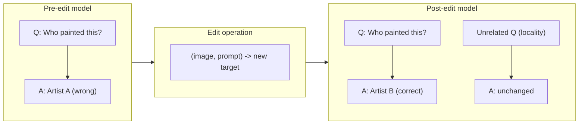
```mermaid
flowchart LR
    subgraph Before["Pre-edit model"]
        Q1["Q: Who painted this?"]
        A1["A: Artist A (wrong)"]
        Q1 --> A1
    end
    subgraph Edit["Edit operation"]
        E["(image, prompt) -> new target"]
    end
    subgraph After["Post-edit model"]
        Q2["Q: Who painted this?"]
        A2["A: Artist B (correct)"]
        Q2 --> A2
        Q3["Unrelated Q (locality)"]
        A3["A: unchanged"]
        Q3 --> A3
    end
    Before --> Edit --> After
```

*Figure 1. A knowledge edit updates the target response on the edited (image, prompt) pair while unrelated locality probes must remain unchanged.*

---

## 2. Problem Statement and Research Questions

**Problem.** Current knowledge-editing methods and benchmarks do not adequately support **long-form edits in multimodal models**. This leads to three practical difficulties:

1. **Efficacy degradation with length** — hidden-state interventions lose influence over distant tokens in long generations.
2. **Evaluation breakdown** — exact string match is near-zero for paragraph-length answers; token-, chunk-, and semantic-level metrics are required.
3. **Lifelong interference** — sequential application of many long edits may erode locality and earlier edits.

**Research questions:**

- **RQ1:** Can autoregressive, chunk-wise editing improve long-form knowledge updates in vision–language models while preserving generality and locality?
- **RQ2:** How does editing granularity (chunk size) affect long-form performance?

**Scope.** A controlled study on VLKEB-long using BLIP2-OPT-2.7b (frozen) and LiveEdit (external MoE editor), comparing single-pass baseline editing against autoregressive chunk editing under matched protocols.

---

## 3. Aims, Objectives, and Contributions

**Aim.** To investigate whether decomposing long edit targets into token chunks and editing them autoregressively benefits long-form multimodal knowledge editing.

| # | Objective | Status |
|---|-----------|--------|
| 1 | Construct a long-form multimodal editing benchmark (VLKEB-long) | Complete |
| 2 | Implement chunk-wise autoregressive editing in LiveEdit | Complete |
| 3 | Train single-pass baseline and autoregressive variants | Complete |
| 4 | Full-scale evaluation (~3150 sequential edits) | Complete |
| 5 | Granularity ablation (chunk sizes 8, 16, 32, 64) | Complete |

**Contributions:**

1. **VLKEB-long** — extension of VLKEB with long-form targets, anchored to original short facts, with a documented construction protocol and quality manifest.
2. **Empirical comparison** — single-pass vs autoregressive chunk editing on the same benchmark, backbone, and lifelong protocol.
3. **Granularity analysis** — inference chunk-size sweep with discussion of metric comparability across window sizes.

---

## 4. Background and Related Work

### 4.1 Literature landscape

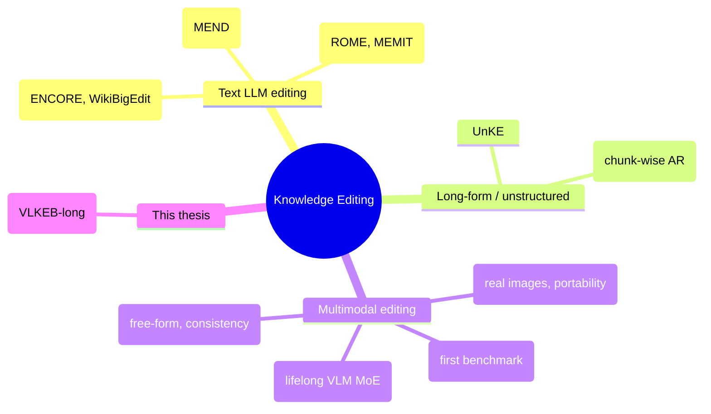
```mermaid
mindmap
  root((Knowledge Editing))
    Text LLM editing
      Locate-then-edit (ROME, MEMIT)
      Hypernetworks (MEND)
      Lifelong / sequential (ENCORE, WikiBigEdit)
    Long-form / unstructured
      UnKE
      AnyEdit (chunk-wise AR)
    Multimodal editing
      MMEdit (first benchmark)
      VLKEB (real images, portability)
      MMKE-Bench / MC-MKE (free-form, consistency)
      LiveEdit (lifelong VLM MoE)
    This thesis
      Long-form VLM editing (VLKEB-long)
```

*Figure 2. Overview of the knowledge-editing literature and the position of this thesis.*

### 4.2 Foundations and surveys

| Work | Year | Contribution | Relevance to this thesis |
|------|------|-------------|--------------------------|
| **Knowledge Editing Survey** (Wang et al.) | 2023–24 | Formalises editing as constrained optimisation over accuracy, locality, generality; taxonomy: external memory / global optimisation / local modification | Defines the metric triple used in evaluation |
| **Pitfalls of Knowledge Editing** (survey) | 2024 | Shows editing causes knowledge distortion and degraded general ability; calls for consistent metrics | Motivates careful evaluation and locality focus |
| **Dual-Axis Taxonomy** | 2025 | Adds a function-based view (factual/temporal/conceptual/…); effectiveness depends on knowledge type | Long-form factual updates are a distinct, harder category |

Editing is well formalised for **short factual** knowledge; long-form and multimodal cases remain open research areas.

### 4.3 Lifelong and long-form text editing

| Work | Year | Contribution | Relevance to this thesis |
|------|------|-------------|--------------------------|
| **WikiBigEdit** | 2025 | 500K+ real Wikidata edits; tests lifelong editing at scale | Realistic sequential-edit pressure |
| **ENCORE** | 2025 | Norm-constrained edits; 10,000 sequential edits without degradation | Locality and forgetting under many edits |
| **UnKE** | 2025 | Edits unstructured / long knowledge beyond single-token updates | Long-form editing in text |
| **AnyEdit** | 2025 | Autoregressive chunk-wise editing; mutual-information motivation; long-form metrics (ROUGE-L, BERTScore) | Core mechanism adapted here for VLMs |

Chunk-wise / autoregressive editing addresses the **length** problem in text but has not been studied for **vision–language** models under lifelong editing.

### 4.4 Multimodal editing and benchmarks

| Work | Year | Contribution | Relevance to this thesis |
|------|------|-------------|--------------------------|
| **MMEdit** | 2023 | First multimodal editing benchmark (VQA + caption) | Origin of multimodal editing evaluation |
| **VLKEB** | 2024 | Real images via multimodal KG; adds portability; harder locality | Base benchmark (short targets) extended to VLKEB-long |
| **MMKE-Bench** | ICLR 2025 | Free-form visual knowledge; entity/semantic/user edits | Argues for natural-language (long) edits |
| **MC-MKE** | ACL 2025 | Fine-grained edits emphasising modality consistency | Motivates careful multimodal metrics |
| **LiveEdit** | CVPR 2025 | Lifelong VLM editing via low-rank MoE experts and two-stage routing | Editor extended in this thesis |

### 4.5 Research gap and positioning

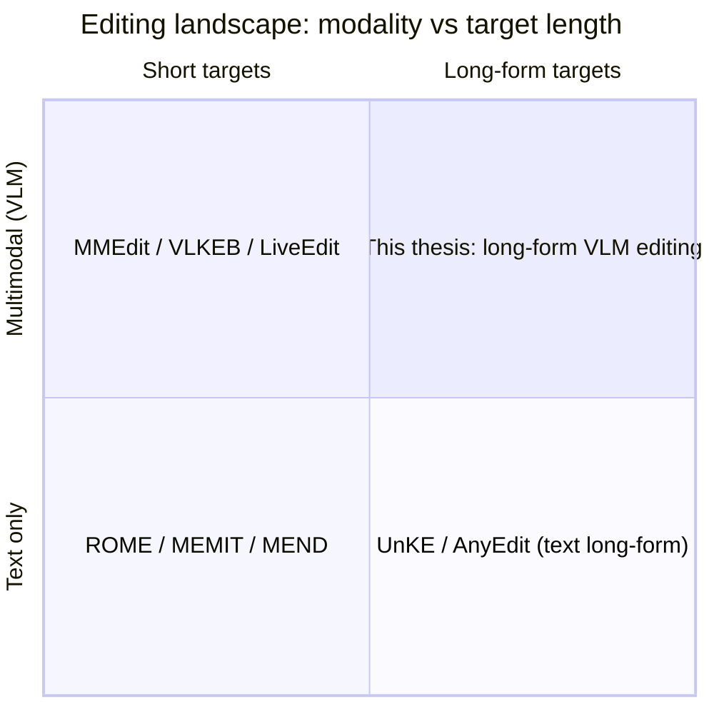
```mermaid
quadrantChart
    title Editing landscape: modality vs target length
    x-axis "Short targets" --> "Long-form targets"
    y-axis "Text only" --> "Multimodal (VLM)"
    quadrant-1 "This thesis: long-form VLM editing"
    quadrant-2 "MMEdit / VLKEB / LiveEdit"
    quadrant-3 "ROME / MEMIT / MEND"
    quadrant-4 "UnKE / AnyEdit (text long-form)"
```

*Figure 3. The upper-right quadrant — long-form targets in multimodal models — is under-explored. Prior VLM editors (VLKEB, LiveEdit) use short targets; prior long-form editors (AnyEdit, UnKE) are text-only.*

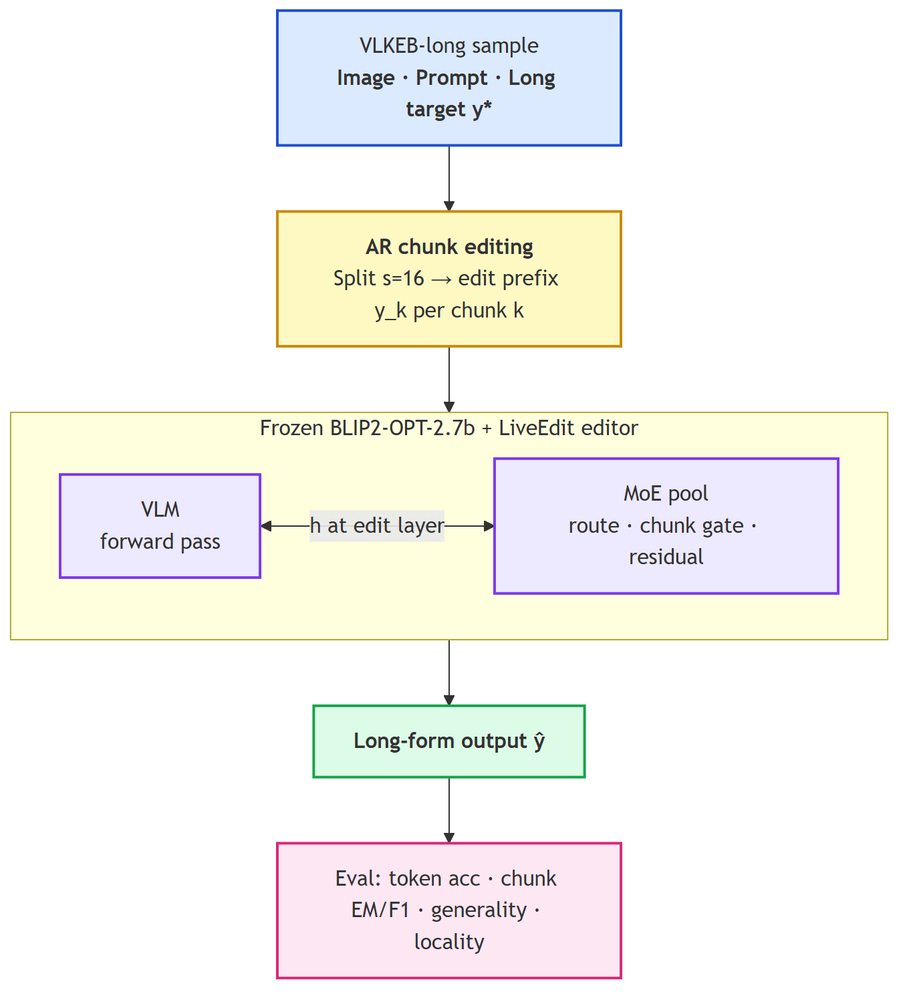

*Figure 4. Compact system view (alternative diagram).*

---

## 5. Methodology

### 5.1 Notation and symbol glossary

| Symbol | Meaning |
|--------|---------|
| **f**_θ | Frozen vision–language model (BLIP2-OPT-2.7b) with parameters θ |
| **E** | External editor (LiveEdit) that updates editor state, not θ |
| **e = (v, p, y^*)** | Edit request: image **v**, prompt **p**, target answer **y^*** |
| **L** | Number of tokens in target y^* |
| **s** | Chunk size in tokens (default **s = 16**) |
| **c_k** | Token chunk k; **K** total chunks |
| **y_k** | Prefix target Dec(c₁, …, c_k) |
| **E_t** | Expert repository after t sequential edits |
| **ℓ_e** | VLM layer at which the edit hook is applied |
| **h^ℓ** | Hidden states at layer ℓ |
| **(U_j, V_j)** | Low-rank expert matrices for expert j |
| **φ̂_v, ψ̂_p** | Visual and prompt routing keys |
| **w_j** | Fusion weight for expert j after routing |
| **ŷ** | Model prediction; **ŷ_ℓ^{pre}** pre-edit answer on locality probe |
| **pp** | Percentage points (absolute difference between percentages) |

### 5.2 Lifelong multimodal editing (LiveEdit framework)

Following LiveEdit (CVPR 2025), the model evolves through a sequence of edits f_θ₀ → f_θ₁ → … → f_θ_t without retraining the VLM backbone. After each edit, the system is evaluated on reliability, text/image generality, and text/image locality probes.

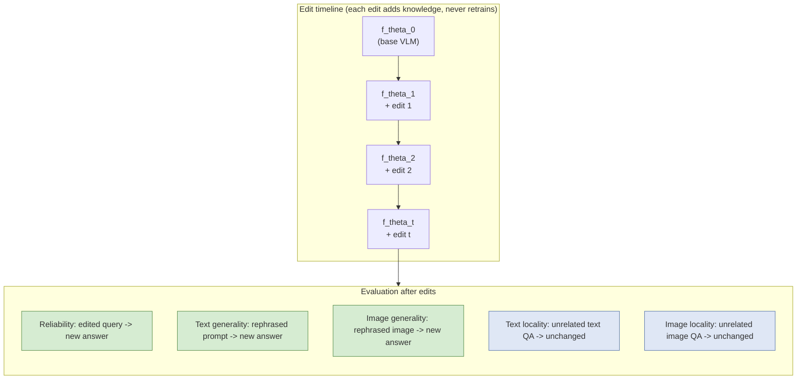
```mermaid
flowchart TB
    subgraph Stream["Edit timeline (each edit adds knowledge, never retrains)"]
        direction LR
        F0["f_theta_0<br/>(base VLM)"] --> F1["f_theta_1<br/>+ edit 1"]
        F1 --> F2["f_theta_2<br/>+ edit 2"]
        F2 --> Ft["f_theta_t<br/>+ edit t"]
    end

    Ft --> Tests

    subgraph Tests["Evaluation after edits"]
        direction TB
        R["Reliability: edited query -> new answer"]
        TG["Text generality: rephrased prompt -> new answer"]
        MG["Image generality: rephrased image -> new answer"]
        TL["Text locality: unrelated text QA -> unchanged"]
        ML["Image locality: unrelated image QA -> unchanged"]
    end

    classDef gen fill:#d6ecd2,stroke:#5a8f4e;
    classDef loc fill:#dfe7f5,stroke:#5a78b0;
    class R,TG,MG gen;
    class TL,ML loc;
```

*Figure 5. Lifelong editing timeline and evaluation domains (adapted from LiveEdit Fig. 1).*

### 5.3 LiveEdit MoE editor architecture

The editor is **external** to the frozen VLM. During editing, hidden states at layer ℓ_e are used to generate low-rank experts and routing features, stored in repository E_t. At inference, hard visual routing and soft prompt routing retrieve relevant experts and apply a residual update.

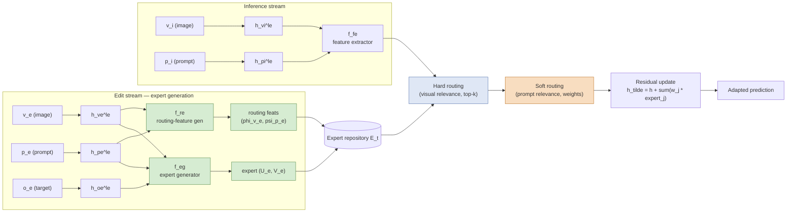
```mermaid
flowchart LR
    subgraph EditStream["Edit stream — expert generation"]
        direction TB
        VE["v_e (image)"] --> HVE["h_ve^le"]
        PE["p_e (prompt)"] --> HPE["h_pe^le"]
        OE["o_e (target)"] --> HOE["h_oe^le"]
        HVE --> FEG
        HPE --> FEG
        HOE --> FEG["f_eg<br/>expert generator"]
        FEG --> UV["expert (U_e, V_e)"]
        HVE --> FRE["f_re<br/>routing-feature gen"]
        HPE --> FRE
        FRE --> RF["routing feats<br/>(phi_v_e, psi_p_e)"]
    end

    UV --> REPO[("Expert repository E_t")]
    RF --> REPO

    subgraph InferStream["Inference stream"]
        direction TB
        VI["v_i (image)"] --> HVI["h_vi^le"]
        PI["p_i (prompt)"] --> HPI["h_pi^le"]
        HVI --> FFE["f_fe<br/>feature extractor"]
        HPI --> FFE
    end

    FFE --> HARD["Hard routing<br/>(visual relevance, top-k)"]
    REPO --> HARD
    HARD --> SOFT["Soft routing<br/>(prompt relevance, weights)"]
    SOFT --> UPD["Residual update<br/>h_tilde = h + sum(w_j * expert_j)"]
    UPD --> OUT["Adapted prediction"]

    classDef gen fill:#d6ecd2,stroke:#5a8f4e;
    classDef hard fill:#dfe7f5,stroke:#5a78b0;
    classDef soft fill:#f8ddc0,stroke:#c0792e;
    class FEG,FRE,UV,RF gen;
    class HARD hard;
    class SOFT soft;
```

*Figure 6. LiveEdit MoE architecture (adapted from LiveEdit Fig. 2). Green: expert generation; blue: hard routing; orange: soft routing.*

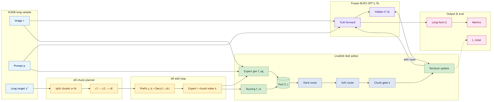

*Figure 7. End-to-end horizontal architecture diagram.*

### 5.4 Single-pass vs autoregressive chunk editing

The baseline applies **one edit** on the full long target (~89 tokens). The AR variant decomposes the target into chunks and applies **prefix-conditioned edits** sequentially.

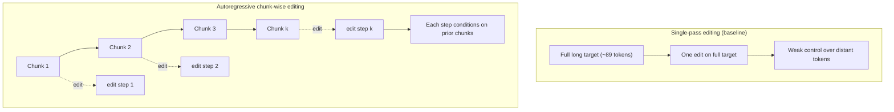
```mermaid
flowchart TB
    subgraph SP["Single-pass editing (baseline)"]
        T1["Full long target (~89 tokens)"]
        ED1["One edit on full target"]
        T1 --> ED1 --> R1["Weak control over distant tokens"]
    end

    subgraph AR["Autoregressive chunk-wise editing"]
        C1["Chunk 1"] --> C2["Chunk 2"] --> C3["Chunk 3"] --> Ck["Chunk k"]
        C1 -.edit.-> M1["edit step 1"]
        C2 -.edit.-> M2["edit step 2"]
        Ck -.edit.-> Mk["edit step k"]
        Mk --> R2["Each step conditions on prior chunks"]
    end
```

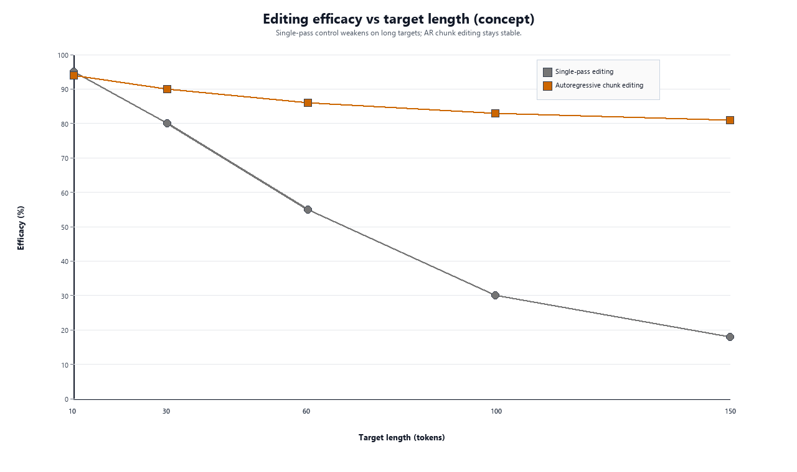

*Figure 8. Conceptual motivation: single-pass editing efficacy declines with target length; autoregressive chunk editing is designed to remain stable at paragraph length.*

### 5.5 Formal edit problem

Let the frozen VLM be **f**_θ. An edit request is a tuple:

    e = (v, p, y^*)

where **v** is an image, **p** a text prompt, and **y^*** the desired long-form answer of **L** tokens. An external editor **E** updates editor state after each edit while VLM weights remain frozen:

    f_{θ_t} = E(f_{θ_{t-1}}, e_t)          θ_t = θ_{t-1}

**Evaluation domains** (LiveEdit / VLKEB protocol):

| Domain | Query | Requirement |
|--------|-------|-------------|
| **Reliability** | (v, p) | ŷ = y^* |
| **Generality** | (v′, p′) rephrased | ŷ = y^* |
| **Locality** | unrelated (v_ℓ, p_ℓ) | ŷ_ℓ = y_ℓ^{pre} |

The informal objective is to maximise reliability and generality while limiting locality drift under sequential edits e₁, e₂, …, e_T.

**Interpretation.**

- The **VLM backbone stays frozen** — all learning occurs in the external LiveEdit editor (MoE experts and routing modules).
- Each lifelong edit adds state to the editor repository; BLIP2 weights are not fine-tuned on the full benchmark.
- Success is measured on **three probe types**, not merely whether the edited answer changed.
- **Reliability** requires the edited model to produce the new long target on the original image and prompt.
- **Generality** requires the same fact to hold when the prompt is rephrased or the image is swapped for a related view.
- **Locality** requires answers to unrelated text/image questions to remain identical to pre-edit behaviour.

### 5.6 Chunk decomposition and autoregressive edit loop

**Token chunking** (chunk size **s**, default **s = 16**). Tokenise target y^* into token IDs and partition:

    y^* = Dec(c₁ ‖ c₂ ‖ … ‖ c_K),     |c_k| ≤ s

Chunking is **token-based** (BLIP2 tokenizer), not sentence-based, consistent with the editor's token-level loss.

**Single-pass baseline** — one expert per request on the full target:

    E_{SP}(e):   E_t ← E_{t−1} ∪ { (U_e, V_e, φ̂_v, ψ̂_p) }

**Autoregressive chunk-wise edit** — for k = 1, …, K, define prefix target y_k = Dec(c₁, …, c_k) and append one expert per step:

    E_{AR}(e):   for k = 1..K:   E_t ← E_{t−1} ∪ Expert(v, p, y_k)

Each expert is tagged with chunk index **k** for chunk-aware routing at inference. If chunking fails, the implementation falls back to single-pass editing on the full target.

**Theoretical motivation** (AnyEdit / mutual-information chain rule; frozen image prefix **V**):

    I(X, V ; Y | h′₁, …, h′_K)  =  Σ_{k=1..K}  I(X, V, Y_{<k} ; Y_k | h′_k)

Because the image encoder is frozen, visual context **V** acts as a fixed prefix; the decomposition applies to the joint (X, V) representation. Long targets decompose into conditionally independent sub-problems per chunk, improving control over distant tokens.

**Interpretation.**

- Chunking is **token-based** (BLIP2 tokenizer), not sentence-based — consistent with the editor's token-level loss.
- Default **s = 16** balances edit granularity against the number of expert inserts per sample.
- The **baseline** stores one low-rank expert per edit, trained to predict the **entire** long target at once — the control condition mirroring original LiveEdit on VLKEB-long.
- At AR step **k**, the edit target is the **prefix** up to chunk k; each step adds a separate expert tagged with index **k** for chunk-aware routing at inference.
- AnyEdit's mutual-information motivation is extended to VLMs: because the image encoder is frozen, visual context **V** is a fixed prefix and the chain-rule decomposition still applies.

### 5.7 MoE residual update and training loss

**Low-rank expert** at edit layer ℓ_e. Hidden states **h^ℓ ∈ ℝ^{L×d}**, retrieved experts **(U_j, V_j)**, fusion weights **w_j**:

    h̃^{ℓ}  =  h^{ℓ}  +  Σ_{j∈R}  w_j · Expert_j(h^{ℓ})

    Expert_j(h)  =  ReLU(h · U_j) · V_j

    w_j  =  softmax(sim_j)  ⊙  σ(sim_j)

where **sim_j = (1/√d_m) · ⟨ψ_i, φ_j⟩** (soft routing); hard routing retains experts with **sim^{vis}_j > sim^{prot}**.

**Training loss** (LiveEdit editor modules only; VLM frozen):

    L_{total} = λ_{rel}·L_{rel} + λ_{gen}·L_{gen} + λ_{loc}·L_{loc} + λ_{sr}·L_{sr} + λ_{hr}·L_{hr}

| Term | Definition | Role |
|------|------------|------|
| **L_rel** | Masked NLL on edited target tokens over mask set M | Reliability |
| **L_rel (AR)** | Per-chunk NLL averaged over K chunks | Per-chunk supervision |
| **L_gen** | Same masked NLL on rephrased text/image probes | Generality |
| **L_loc** | KL divergence between pre-edit and post-edit logits on locality probes | Locality |
| **L_route** | Contrastive routing loss on visual and textual neighbour pairs | Expert retrieval |

**Training setup:** 20 epochs on VLKEB-long train split; BLIP2-OPT-2.7b frozen; only editor modules (f_eg, f_re, routers) updated. Two checkpoints: **long-trained baseline** (single-pass) and **long-trained AR** (chunk size 16).

**Interpretation.**

- **Hard routing (visual):** retrieves experts whose stored image features match the current input image.
- **Soft routing (text):** weights experts by prompt similarity — multiple experts may be fused when several edits are relevant.
- The edit is a **residual** added at one mid-layer; the remainder of the VLM forward pass is unchanged.
- **L_rel** teaches the editor to predict new target tokens on the edited (image, prompt) pair; the AR variant averages **per-chunk** NLL.
- **L_gen** ensures the edit survives paraphrased text and rephrased images.
- **L_loc** penalises logit drift on locality questions to keep unrelated answers stable.
- **L_route** trains the router to select the correct expert and ignore irrelevant entries in the pool.

### 5.8 Evaluation metrics — definitions

**Token accuracy** (reliability / generality):

    Acc = (1/N) · Σ_i  1[y_i = ŷ_i]     over masked target tokens

Fraction of target tokens predicted correctly after editing. Applied to reliability and to text/image generality probes.

**Exact match (EM):**

    EM = 1[y^* = ŷ]

Verbatim string match. Expected **≈ 0%** when **L ≈ 89**; reported for completeness, not as primary outcome.

**Chunk EM and Chunk F1** (chunk size **s**, aligned windows [start, start+s)):

    Chunk-EM = (1/|C|) · Σ_c  1[ŷ_c = y_c]

    Chunk-F1_c = (Σ_i  1[ŷ_i = y_i] · m_i) / (Σ_i m_i)

    Chunk-F1 = (1/|C|) · Σ_c  Chunk-F1_c

- **Chunk EM** — fraction of s-token windows where every token matches exactly (AnyEdit-style segment match).
- **Chunk F1** — average per-window token overlap; more forgiving than chunk EM.
- Default **s = 16** at evaluation unless ablating chunk size.
- **Chunk EM is not comparable across different chunk sizes** (different scoring windows).

**Locality accuracy:** fraction of locality probes where the edited model matches the pre-edit answer, reported separately for text and image probes.

**Lifelong evaluation protocol:** sequential batches of **n = 50** edits, seed 42, **T ≈ 3150** total edits on VLKEB-long eval. Same protocol for baseline and AR.

**Interpretation.**

- **Token accuracy** is the primary reliability score: fraction of target tokens predicted correctly after editing; the same metric is applied to text- and image-generality probes.
- **Exact match** is verbatim string equality — too strict for long-form outputs (~89 tokens); included for completeness, not as the headline result.
- **Chunk EM** measures the fraction of s-token windows where **every** token in the window is correct (AnyEdit-style segment match).
- **Chunk F1** is the average per-window token overlap — more forgiving than chunk EM but still length-aware.
- Both chunk metrics use **s = 16** at evaluation unless ablating chunk size; **chunk EM is not comparable across different chunk sizes**.
- **Locality accuracy** is reported separately for text and image probes from VLKEB.
- Edits are applied **sequentially** — later edits see the full expert pool from earlier edits (lifelong stress test); seed 42 is fixed for reproducibility.

### 5.9 Five-phase implementation pipeline

The thesis implementation is organised as a **five-phase pipeline** rather than a monolithic end-to-end model. Each phase has a single responsibility: prepare data, plan chunks, store edits, apply edits at inference, and measure outcomes.

| Phase | Name | Primary responsibility | Main output |
|-------|------|------------------------|-------------|
| **1** | Data & benchmark | Build VLKEB-long from official VLKEB | Long-form JSON + quality manifest |
| **2** | Chunk planning | Split targets; schedule AR prefix edits | Chunks c₁…c_K; edit steps k=1…K |
| **3** | Expert pool | Generate and store LiveEdit MoE experts | Repository E_t with routing keys |
| **4** | Routed inference | Retrieve experts; update frozen BLIP2 | Long-form prediction ŷ |
| **5** | Train & evaluate | Fit editor; run lifelong benchmark | Baseline vs AR metrics |

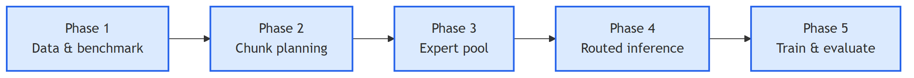

*Figure 9. Five-phase architecture overview.*

**Pipeline flow.** The pipeline begins from the official **VLKEB benchmark**, extending only the edit targets into **VLKEB-long** so that every image, prompt, and probe remains comparable to prior work. Each long answer then passes through **chunk planning**, where it is split and scheduled for autoregressive prefix edits. For every scheduled step, the system **mints a new expert** and adds it to a growing pool rather than modifying VLM weights. At inference time, the model **routes to the appropriate experts** and applies a lightweight residual update on top of the frozen BLIP2 backbone. Finally, the editor is **trained** on the long-form train split and **both variants**—baseline and autoregressive—are **evaluated** under the same lifelong protocol.

**How the phases connect.** Each VLKEB-long row from Phase 1 flows into Phase 2, where its long target is decomposed into chunks and an edit schedule. Every step on that schedule triggers Phase 3 to add another expert to the pool; at inference time Phase 4 retrieves from that pool to steer the frozen VLM. Phase 5 trains the components that Phases 3–4 rely on and measures whether the full pipeline delivers better long-form editing without breaking locality.

**Design principle.** Phases **1–2** decide *what* to edit; Phases **3–4** decide *how* the edit is stored and applied; Phase **5** decides *whether* the approach works. The VLM backbone is accessed only in Phase **4** (inference hook) and remains frozen during training in Phase **5**.

#### Phase 1 — Data and benchmark (VLKEB-long)

**Responsibility.** Extend VLKEB with long-form edit targets **without** changing images, prompts, generality rephrases, or locality probes.

**Description.** Each construction run starts from an official **VLKEB row**—the same image, question, and short answer used in prior multimodal editing work. A vision+text model (Ollama) **expands the short fact into a paragraph-length answer**. Before accepting a draft, the pipeline verifies that the long text **still contains the original short string** (`alt_short`), so the elongated answer cannot drift to an unrelated fact. The answer must also fall in a **valid length band** (approximately 65–150 tokens); if either check fails, generation is retried or a template fallback is used. Passing rows are published to VLKEB-long together with a manifest recording which quality gates each sample satisfied.

| Step | Action | Detail | Output |
|------|--------|--------|--------|
| 1.1 | Load official VLKEB row | Keep image path, question, short alt, rephrase and locality fields | (v, p, alt_short) |
| 1.2 | Long-form generation | Ollama vision+text model expands short fact into paragraph | draft y^* (~65–150 tok) |
| 1.3 | Anchor check | Reject if draft does not contain original short string | pass / retry |
| 1.4 | Length gate | Enforce 65–150 token band | pass / retry |
| 1.5 | Publish | Write row to JSON + manifest | VLKEB-long split |

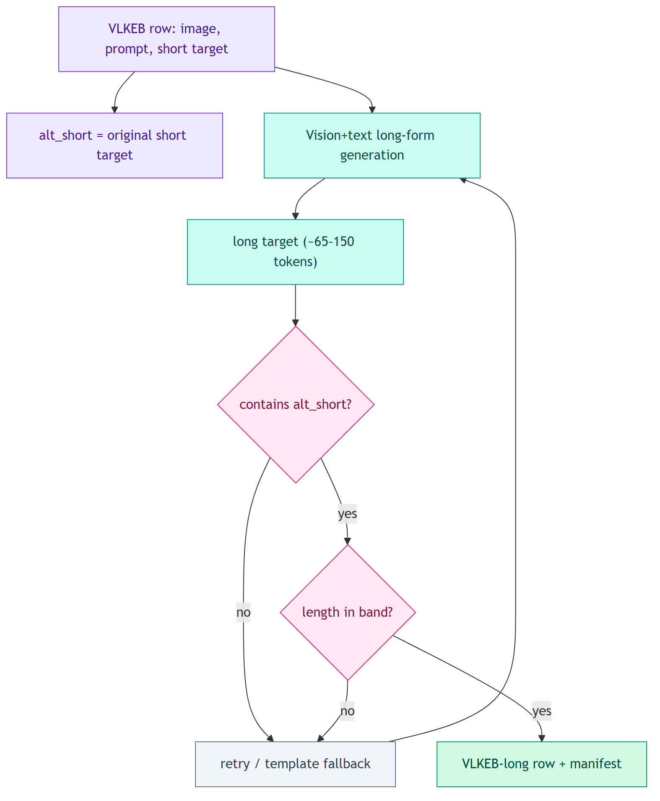

*Figure 10. VLKEB-long construction with anchor and length quality gates.*

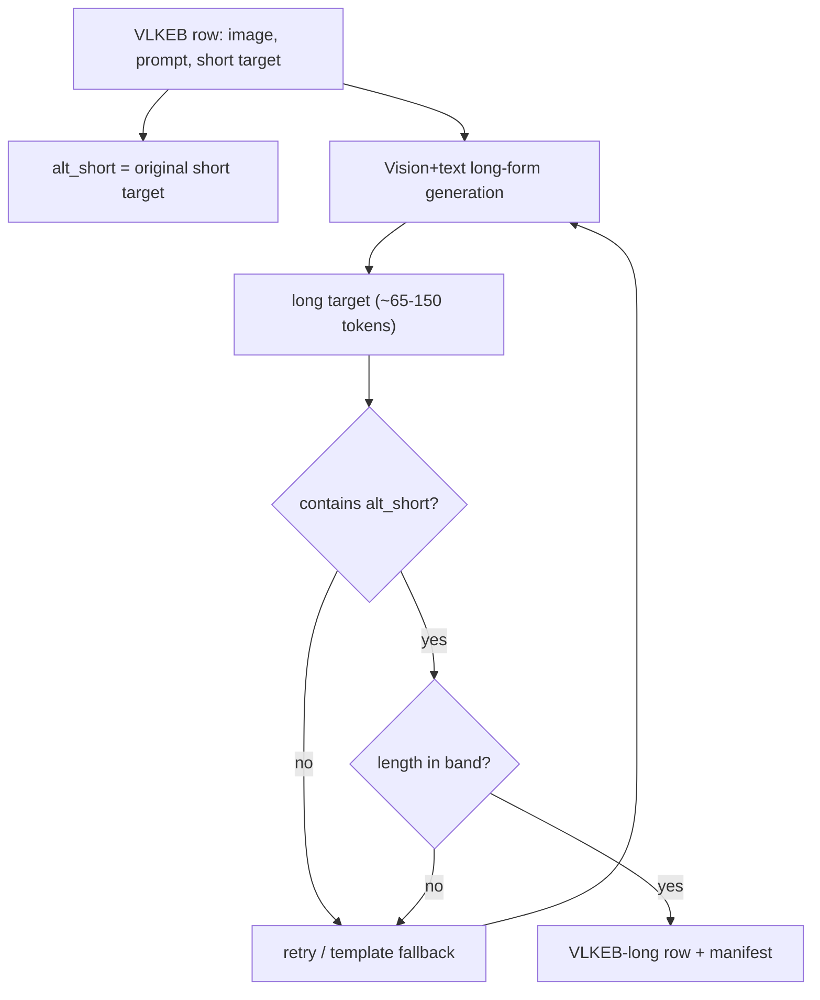
```mermaid
flowchart TB
    Row["VLKEB row: image, prompt, short target"]
    Row --> Short["alt_short = original short target"]
    Row --> Gen["Vision+text long-form generation"]
    Gen --> Long["long target (~65-150 tokens)"]
    Long --> V1{"contains alt_short?"}
    V1 -->|no| Retry["retry / template fallback"]
    V1 -->|yes| V2{"length in band?"}
    V2 -->|no| Retry
    V2 -->|yes| Out["VLKEB-long row + manifest"]
    Retry --> Gen
```

**Key points.**

- **What stays the same:** all images, prompts, text/image generality pairs, and text/image locality questions — only the **edit target** grows longer.
- **Why anchor?** Guarantees the long answer still expresses the **same core fact** as the original VLKEB short target (lexical tie, not human re-annotation).
- **Scale:** 3174 eval rows built; **3150** used in full sequential eval; mean target length **~89 tokens** (vs a few tokens in original VLKEB).
- **Limitation:** anchoring is **lexical**, not a guarantee that every clause in the long answer is visually grounded — this is stated explicitly in the thesis.

**Outputs.** Phase 1 feeds Phase 2 (chunking) and Phase 5 (train/eval splits).

#### Phase 2 — Chunk planning and AR scheduling

**Responsibility.** Decompose each long target into token chunks and define **when** and **on what prefix** each edit is applied.

**Description.** Given a long target y^*, the system **tokenises** it with the same BLIP2 tokenizer used at train and test time, then **slices the token stream into fixed windows** of 16 tokens to obtain chunks c₁ through c_K. Rather than editing the full answer in one shot, the pipeline walks forward chunk by chunk: at step k it **reconstructs the prefix** y_k consisting of all chunks up to k, and **schedules one edit** on the triple (image, prompt, y_k). This autoregressive schedule ensures each edit builds on prior chunks—chunk 2 is edited with chunk 1 already in place—and each scheduled step is passed to Phase 3 to create its own expert.

| Step | Action | Detail | Output |
|------|--------|--------|--------|
| 2.1 | Tokenize y^* | BLIP2 tokenizer | token ID list |
| 2.2 | Split chunks | Fixed size s = 16 tokens per chunk | c₁, c₂, …, c_K |
| 2.3 | Build prefix | y_k = Dec(c₁…c_k) | progressive targets |
| 2.4 | Schedule edits | For k = 1..K, queue edit on (v, p, y_k) | K edit steps per sample |

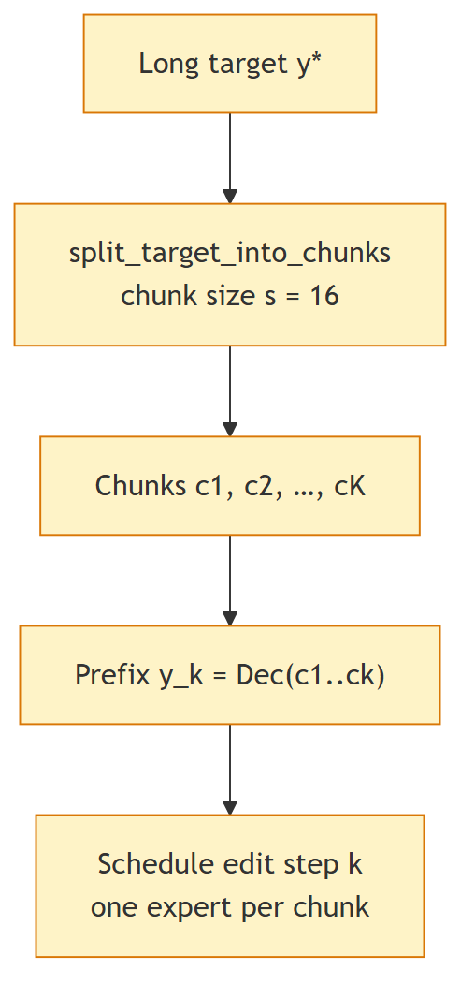

*Figure 11. Phase 2: token chunking and autoregressive edit scheduling.*

**Key points.**

- **Why token chunks?** The editor loss and generation are token-level; chunk size aligns with AnyEdit-style windows and the chunk EM evaluation metric.
- **Autoregressive meaning:** edit step k supervises the **new** chunk tokens while the prefix provides context — analogous to training on partial sequences.
- **Chunk index k** is stored with each expert (Phase 3) so inference can gate retrieval to the correct segment (Phase 4).
- **Fallback:** if chunking fails (empty target, tokenizer edge case), the system falls back to **single-pass** edit on the full y^*.

**Baseline contrast.** The single-pass baseline runs **one** edit on the full y^* and skips prefix scheduling (steps 2.3–2.4).

**Outputs.** Phase 2 feeds Phase 3 (one expert per scheduled step) and Phase 5 (chunk-size ablation at s ∈ {8, 16, 32, 64}).

#### Phase 3 — Expert generation and lifelong pool

**Responsibility.** For every edit step, encode the multimodal edit sample, generate a low-rank expert and routing features, and append to repository **E_t**.

**Description.** For each edit step scheduled in Phase 2, the multimodal sample **(image, prompt, prefix target y_k)** is forwarded through the **frozen BLIP2 model**. Hidden representations at the edit layer are read for vision, prompt, and answer tokens. The **expert generator** f_eg produces a compact low-rank module (U_k, V_k); the **routing module** f_re extracts visual and textual keys (φ̂_v, ψ̂_p) for later retrieval. The expert, keys, and chunk tag are **appended to the lifelong repository E_t**. VLM weights are never overwritten—each new edit adds another retrievable module to the pool.

| Step | Action | Detail | Output |
|------|--------|--------|--------|
| 3.1 | Encode sample | Forward (v, p, y_k) through frozen BLIP2 at layer ℓ_e | hidden states |
| 3.2 | Expert generator f_eg | Low-rank matrices from edit representations | (U_k, V_k) |
| 3.3 | Routing gen f_re | Extract visual and prompt keys | (φ̂_v, ψ̂_p) |
| 3.4 | Append to pool | Store expert + keys; tag chunk index k (AR) or −1 (baseline) | E_t grows |

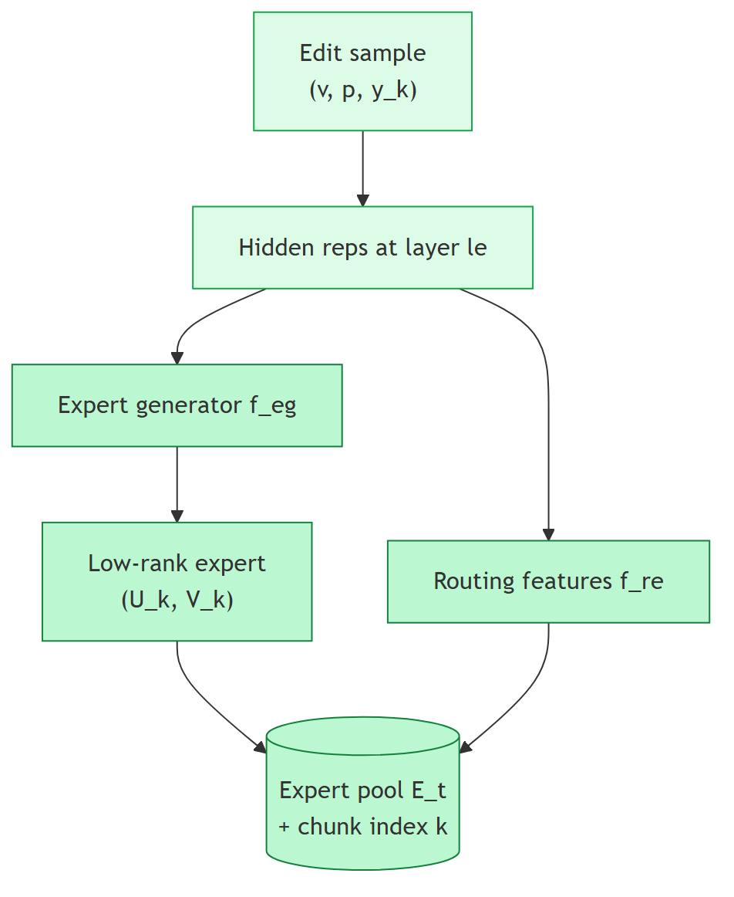

*Figure 12. Phase 3: expert generation; VLM weights are never updated.*

**Key points.**

- **External editing:** BLIP2-OPT-2.7b weights are **never** updated — only the editor modules (f_eg, f_re, routers) are trained.
- **Lifelong property:** experts **accumulate** across sequential edits; later queries may retrieve multiple past experts via routing.
- **AR vs baseline:** AR adds **K experts per long edit** (one per chunk); baseline adds **one expert per edit** on the full target.
- **Memory implication:** longer targets produce more chunks and a larger pool per sample — relevant under sequential evaluation (n = 50 edits per batch).

**Outputs.** Phase 3 feeds Phase 4 (expert pool queried at inference) and Phase 5 (training optimises f_eg, f_re, and routers).

#### Phase 4 — Routed inference on frozen BLIP2

**Responsibility.** At query time, retrieve relevant experts from E_t and inject a **residual update** into hidden states at edit layer ℓ_e of the frozen VLM.

**Description.** When a query **(image, prompt)** is submitted, BLIP2 runs forward until the hooked edit layer, yielding base hidden states h^ℓ. **Hard routing** retains experts whose stored visual key matches the current scene; **soft routing** reweights survivors by prompt similarity. In autoregressive mode, a **chunk gate** further restricts retrieval to experts tagged for the chunk currently being decoded. Selected experts are fused into a **residual update** added to h^ℓ; the VLM then continues through upper layers and produces the **long-form answer** ŷ without modifying backbone weights.

| Step | Action | Detail | Output |
|------|--------|--------|--------|
| 4.1 | VLM forward | Run BLIP2 on (v_i, p_i); capture h^ℓ | base hidden states |
| 4.2 | Hard routing | Match stored φ̂_v to input image | candidate subset |
| 4.3 | Soft routing | Weight by prompt similarity ψ̂_p | fusion weights w_j |
| 4.4 | Chunk gate (AR) | Restrict to experts tagged for chunk k | chunk-aligned set |
| 4.5 | Residual update | h̃^ℓ = h^ℓ + Σ_j w_j · Expert_j(h^ℓ) | edited representation |
| 4.6 | Decode | Continue VLM layers above ℓ_e | long-form ŷ |

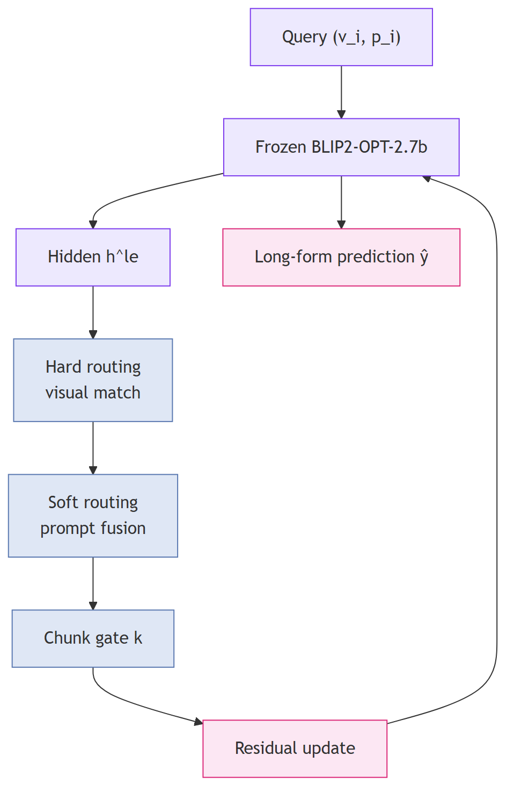

*Figure 13. Phase 4: two-stage routing, chunk gate (AR), and residual update.*

**Key points.**

- **Two-stage routing (LiveEdit):** hard routing asks whether the visual situation matches; soft routing asks whether the prompt wording matches.
- **Chunk gate (AR-only):** prevents a chunk-3 expert from firing when generating chunk-1 tokens — aligns inference with AR training structure.
- **Non-destructive edit:** if no expert matches, routing can fall back to base VLM behaviour via the prototype threshold in hard routing.
- **Edit location:** a single mid-layer hook — minimal intrusion into the 2.7B-parameter forward pass.

**Outputs.** Phase 4 feeds Phase 5 (reliability, generality, and locality probes all run through this inference path).

#### Phase 5 — Training and evaluation

**Responsibility.** Fit editor parameters on the VLKEB-long train split; evaluate baseline vs AR under an identical **lifelong** protocol with long-form-aware metrics.

**Description.** Only the **editor modules** are trained for 20 epochs on the VLKEB-long train split while BLIP2 remains frozen, optimising the combined loss L_total that encourages correct edits, stable locality, and reliable routing. This yields two checkpoints—the **single-pass baseline** and the **autoregressive variant**— differing only in how edits are scheduled during training. Both models are then evaluated under the **same protocol**: approximately 3150 edits applied sequentially in batches of 50, so the expert pool grows under realistic lifelong pressure. After editing, the model is probed on **reliability, generality, and locality**; long-form performance is summarised with **token accuracy and chunk-level EM/F1**, which are more informative than exact match for ~89-token targets.

| Step | Action | Detail | Output |
|------|--------|--------|--------|
| 5.1 | Train editor | 20 epochs; BLIP2 frozen; optimise L_total | baseline & AR checkpoints |
| 5.2 | Sequential editing | Batches of 50 edits; pool grows across stream | state E_t |
| 5.3 | Probe evaluation | Reliability, text/image generality, text/image locality | per-probe accuracy |
| 5.4 | Long-form metrics | Token accuracy + chunk EM/F1 (s=16) | result tables |

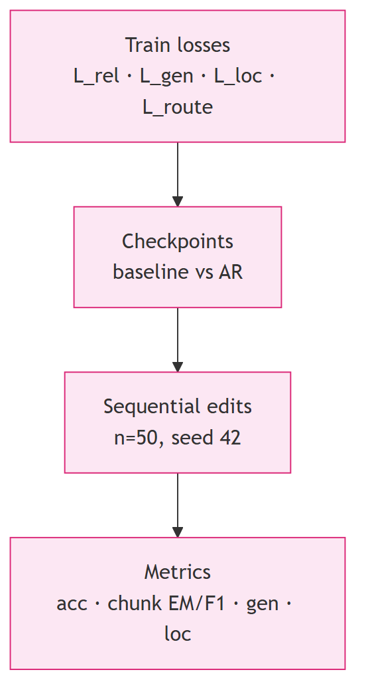

*Figure 14. Phase 5: editor training and lifelong evaluation.*

**Training loss breakdown (Phase 5 training).**

- **L_rel** — predict edited target tokens (AR: averaged per-chunk NLL).
- **L_gen** — same on rephrased prompt/image probes (generality).
- **L_loc** — KL penalty keeping unrelated probe logits near pre-edit values (locality).
- **L_route** — contrastive routing losses so the correct expert is retrieved at inference (Phase 4).

**Evaluation protocol (fixed for both models).**

- Seed **42** · **~3150** edits · mean target **~89 tokens** · predominantly **65+ token** bin.
- **Controlled variable:** single-pass vs AR chunk editing — all other settings matched.

**Deliverables.** Comparison JSON (`eval_results/comparison/`), thesis result tables, validation flags (long-form improvement ✓, locality bounded ✓).

### 5.10 Overall experimental pipeline

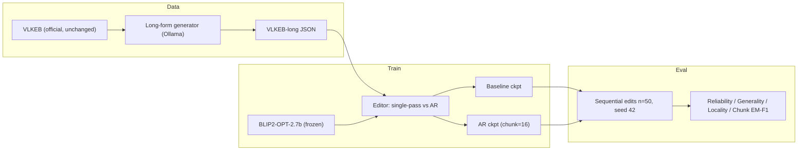
```mermaid
flowchart LR
    subgraph Data
        V["VLKEB (official, unchanged)"]
        G["Long-form generator (Ollama)"]
        VL["VLKEB-long JSON"]
        V --> G --> VL
    end
    subgraph Train
        B["BLIP2-OPT-2.7b (frozen)"]
        ED["Editor: single-pass vs AR"]
        VL --> ED
        B --> ED
        ED --> CK1["Baseline ckpt"]
        ED --> CK2["AR ckpt (chunk=16)"]
    end
    subgraph Eval
        S["Sequential edits n=50, seed 42"]
        MET["Reliability / Generality / Locality / Chunk EM-F1"]
        CK1 --> S
        CK2 --> S
        S --> MET
    end
```

*Figure 15. End-to-end pipeline: data construction, training of two editor variants, and matched lifelong evaluation.*

| Stage | What happens | Rationale |
|-------|----------------|-----------|
| **Data** | Official VLKEB images/prompts kept; only targets elongated | Isolates the long-form variable |
| **Train** | Same backbone and train split; only single-pass vs AR differs | Fair controlled comparison |
| **Eval** | Both checkpoints on full VLKEB-long, 3150 sequential edits | Tests long-form gains and lifelong stability |

---

## 6. Experimental Setup

| Item | Configuration |
|------|---------------|
| Backbone | BLIP2-OPT-2.7b (frozen) |
| Editor | LiveEdit MoE (external) |
| Train data | VLKEB-long train split (`train_longform_ollama.json`) |
| Eval data | VLKEB-long eval split (`eval_longform_ollama.json`) |
| Baseline checkpoint | VLKEB_long_baseline, epoch 20 |
| AR checkpoint | VLKEB_long_ar, epoch 20, trained with chunk_size=16 |
| AR default eval | chunk_size=16 (matches training) |
| Sequential edits per batch | 50 |
| Eval seed | 42 |
| Total edits evaluated | 3150 |
| Mean target length | ~89 tokens (88.6 measured) |

**Controlled comparison.** Identical data, backbone, training budget, and evaluation protocol; the only deliberate difference between baseline and AR is single-pass vs autoregressive chunk editing during training and default inference.

**Result artifacts:** `eval_results/comparison/liveedit_vs_ar_seed42_longform.json`, `eval_results/comparison/ar_chunk_size_sweep.json`.

---

## 7. Results

### 7.1 Primary comparison: long-trained baseline vs AR (cs=16)

Both models were trained on VLKEB-long for 20 epochs and evaluated under the lifelong protocol (3150 edits, seed 42).

| Metric | Baseline | AR (cs=16) | Δ (AR − baseline) |
|--------|----------|------------|-------------------|
| Reliability — token accuracy | 75.40% | 75.94% | +0.54 pp |
| Reliability — chunk EM | 13.50% | 14.82% | +1.32 pp |
| Reliability — chunk F1 | 76.28% | 76.90% | +0.62 pp |
| Reliability — exact match | 0.00% | 0.00% | 0.00 pp |
| Generality — text rephrase | 75.21% | 75.63% | +0.42 pp |
| Generality — image rephrase | 71.49% | 72.51% | +1.02 pp |
| Locality — text | 100.00% | 100.00% | 0.00 pp |
| Locality — image | 100.00% | 100.00% | 0.00 pp |
| 65+ bin — token accuracy (n=3149) | 75.40% | 75.95% | +0.55 pp |

AR improves every reliability and generality metric with no locality degradation. The largest relative gain is on **chunk EM** (+1.32 pp), consistent with segment-wise editing improving control over long targets.

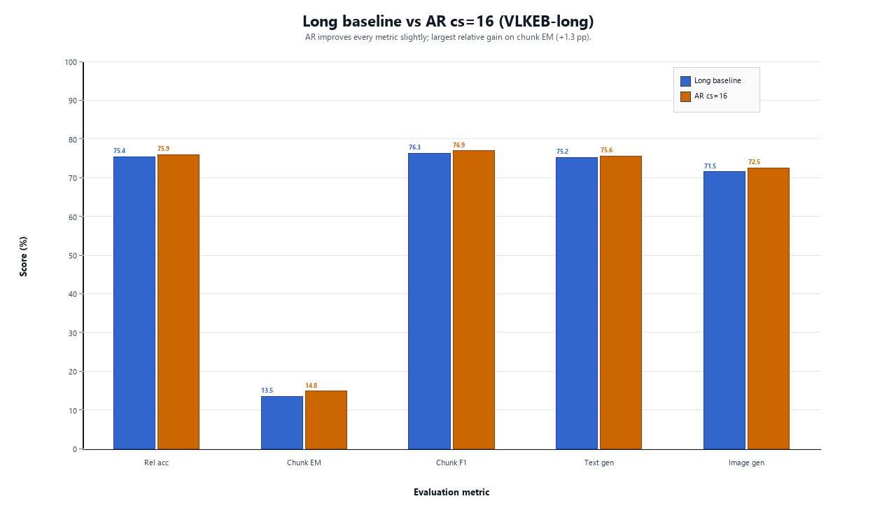

*Figure 16. Long baseline vs AR cs=16 on VLKEB-long evaluation metrics.*

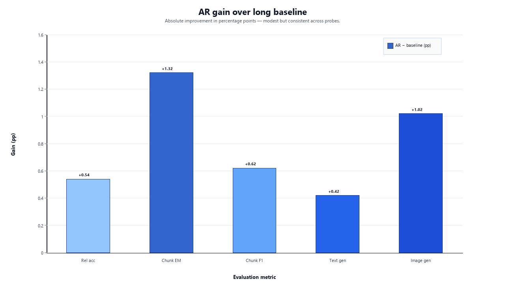

*Figure 17. Absolute AR − baseline gain in percentage points.*

**Validation criteria:**

| Criterion | Result |
|-----------|--------|
| Long-form improvement (65+ token bin) | Pass (+0.55 pp) |
| Locality bounded (≤5% drop) | Pass (0% drop) |
| Generality not degraded | Pass |

### 7.2 Effect of long-form training

| Run | Rel acc | Chunk EM | Chunk F1 | Text gen | Image gen | Locality | Mean tokens |
|-----|---------|----------|----------|----------|-----------|----------|-------------|
| Short-trained → short eval (VLKEB) | 95.53% | 85.14% | 95.53% | 95.34% | 91.72% | 100% | 3.7 |
| Short-trained → long eval | 28.57% | 1.68% | 30.62% | 28.79% | 28.85% | 100% | 88.6 |
| Long-trained baseline → long eval | 75.40% | 13.50% | 76.28% | 75.21% | 71.49% | 100% | 88.6 |
| Long-trained AR (cs=16) → long eval | 75.94% | 14.82% | 76.90% | 75.63% | 72.51% | 100% | 88.6 |

A short-target editor on VLKEB-long achieves only 28.6% reliability (−46.8 pp vs long-trained baseline). Retraining on VLKEB-long restores 75.4%. Locality remains at 100% even when reliability fails. AR contributes +0.54 pp on top of long-form training.

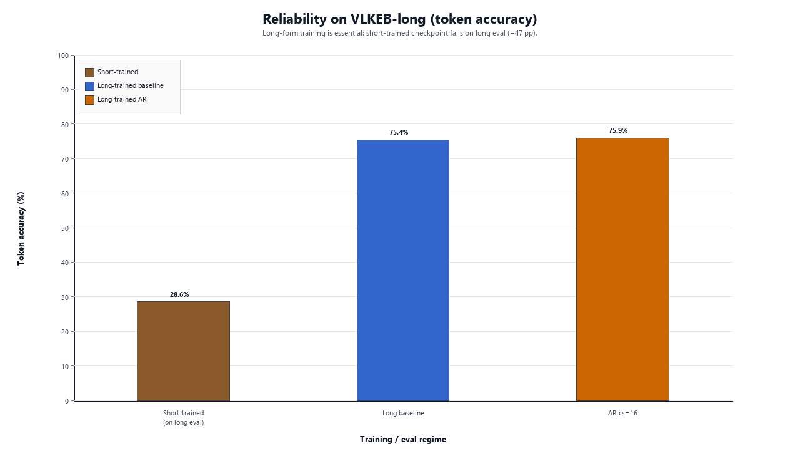

*Figure 18. Token accuracy by training/eval regime — long-form training dominates; AR adds a modest increment.*

### 7.3 Inference chunk-size ablation

Using the same AR checkpoint (trained with cs=16), only inference chunk size was varied:

| chunk_size | Rel acc | Chunk EM | Chunk F1 | Locality |
|------------|---------|----------|----------|----------|
| 8 | 75.94% | 26.26% | 76.48% | 100% |
| **16 (default)** | **75.94%** | **14.82%** | **76.90%** | **100%** |
| 32 | 75.94% | 8.11% | 77.30% | 100% |
| 64 | 75.94% | 6.14% | 77.88% | 100% |

Token accuracy, generality, and locality are identical across all settings. Chunk EM decreases with larger windows (metric effect); chunk_size=16 matches training and enables fair baseline comparison.

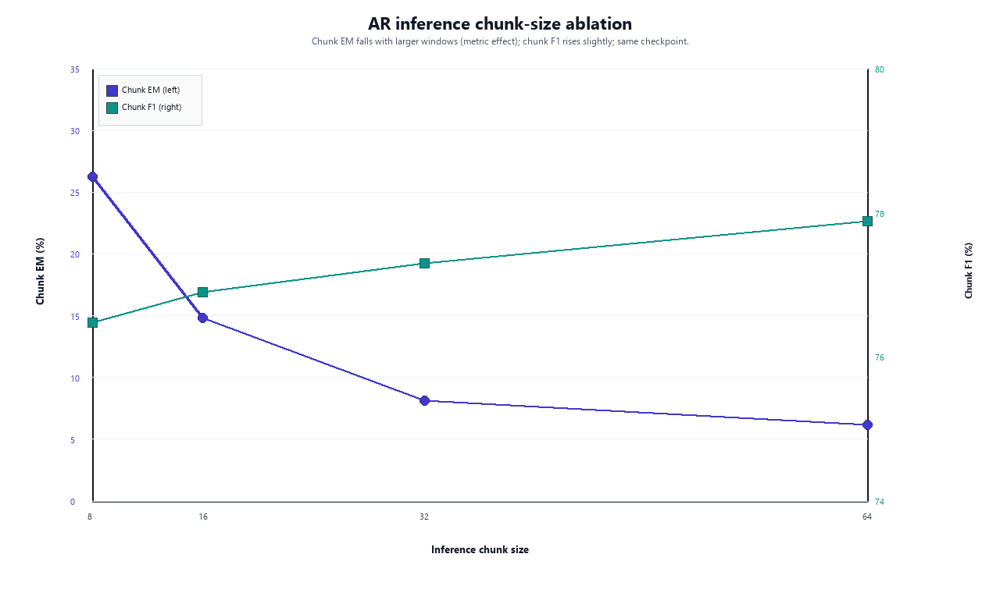

*Figure 19. Chunk-size ablation: chunk EM (left axis) and chunk F1 (right axis).*

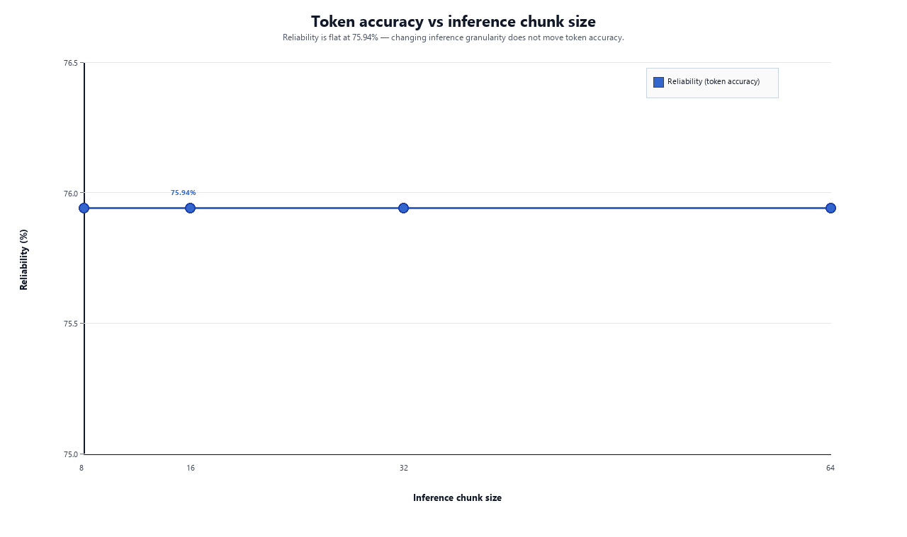

*Figure 20. Reliability is flat at 75.94% across chunk sizes 8–64.*

---

## 8. Discussion

**RQ1 — Autoregressive chunk editing.** AR yields consistent but modest improvements (+0.54 pp token accuracy, +1.32 pp chunk EM) with no locality cost. The largest relative gain on chunk EM supports the claim that chunk-wise editing helps satisfy long targets in segment-sized units.

**RQ2 — Chunk granularity.** Inference chunk size does not change token-level reliability when trained with cs=16. Chunk EM is not comparable across sizes; cs=16 aligns training and evaluation.

**Training vs mechanism.** The dominant effect is long-form training (+46.8 pp vs short-trained-on-long), not AR vs baseline (+0.54 pp). These two effects must be reported separately.

**Exact match.** EM ≈ 0% is expected for ~89-token targets. Token accuracy and chunk EM/F1 are the appropriate primary metrics.

**Limitations:** single backbone and editor; lexical anchoring in VLKEB-long; single eval seed; no ROUGE-L/BERTScore yet; modest AR effect sizes.

---

## 9. Conclusion and Next Steps

This thesis identifies and begins to fill a gap in long-form multimodal knowledge editing. VLKEB-long provides a reproducible benchmark extension; autoregressive chunk-wise editing shows consistent but modest gains without compromising locality. Long-form training is a prerequisite for acceptable reliability on paragraph-length edits.

**Planned next steps:**

1. Integrate methodology, results, and discussion into final thesis chapters.
2. Add significance testing and additional eval seeds if feasible.
3. Supplement metrics (ROUGE-L, BERTScore) for long-form outputs.
4. Finalise limitations and future work (vision-gated chunking, additional backbones, deeper lifelong sweeps).

---

## 10. References and Artifacts

**Primary methods cited:** LiveEdit (Chen et al., CVPR 2025); AnyEdit (ICML 2025); VLKEB (2024); Wang et al. knowledge editing survey (2023–24).

**Supporting documents:**

| File | Content |
|------|---------|
| `THESIS_FULL_EVAL_COMPARISON.md` | All eight evaluation runs consolidated |
| `THESIS_RESULTS_VLKEB_LONG.md` | Primary baseline vs AR results |
| `THESIS_AR_CHUNK_SIZE_SWEEP.md` | Chunk-size ablation detail |
| `THESIS_PRESENTATION_V5.md` | Defence presentation / presenter notes |

**Figures:** `doc/phases/`, `doc/results/`, `doc/THESIS_architecture_diagram_*.png`

**Evaluation outputs:** `eval_results/comparison/*.json`

**Regenerate Word document:** `python tools/build_thesis_supervisor_report_docx.py`

---

*Prepared for supervisory review. Please contact [Your Name] with questions or feedback.*
