# AR-LiveEdit Execution Plan (BLIP2 + VLKEB Incremental)

Version: `v1.1.0`  
Date: `2026-02-15`  
Scope: BLIP2 + VLKEB only (small reversible tasks)

## Scope (Locked for Now)

- Model: **BLIP2 only**.
- Dataset: **VLKEB only**.
- Goal: build a stable AR-LiveEdit prototype with minimal risk before scaling to other models/datasets.
- Strategy: tiny changes, validate each step, then proceed.

## Success Definition for This Stage

- AR mode runs end-to-end on BLIP2+VLKEB.
- Long-form target performance improves vs current LiveEdit baseline on VLKEB length bins.
- Locality and generality remain close to baseline (no major regression).

## Files You Will Touch First

- `editor/vllm_editors/liveedit/liveedit.py`
- `train_vllm_editor.py`
- `evaluation/vllm_editor_eval.py`
- `test_vllm_edit.py`
- `dataset/vllm.py` (only if needed)

## Micro-Task Workflow (Each Task Independently Validated)

### Task 0: Baseline Freeze

- Run current LiveEdit on BLIP2 + VLKEB with fixed seed.
- Save baseline results as immutable reference.
- Validate:
  - Script runs without code changes.
  - Baseline metrics JSON exists and is archived.

### Task 1: Add AR Config Flags Only

- Add flags with no behavior change:
  - `--ar_mode`
  - `--chunk_size`
  - `--max_chunks`
- Validate:
  - Runs with and without flags are identical when `ar_mode=false`.

### Task 2: Implement Target Chunking Utility (Isolated)

- Split `target_new` into token chunks and reconstruct.
- Do not connect to training/inference yet.
- Validate:
  - `reconstruct(chunks) == original_target` on sampled VLKEB entries.

### Task 3: Data Path Hook for AR Metadata

- Attach chunk metadata to requests when `ar_mode=true`.
- Keep old path untouched for `ar_mode=false`.
- Validate:
  - Batch build succeeds with AR metadata.

### Task 4: AR Training Loop Skeleton

- Add chunk-step loop in `train_a_batch`, initially using simple per-step aggregate.
- Keep behind `ar_mode=true`.
- Validate:
  - One short epoch runs on small VLKEB subset.
  - Loss finite, no NaNs.

### Task 5: AR Inference Loop Skeleton

- Add chunk-wise inference/edit loop for one request.
- Keep safe fallback to original single-pass edit path.
- Validate:
  - `edit_one_piece` works in both modes.

### Task 6: Chunk-Aware Routing (Minimal)

- Add step-aware routing signal (chunk index feature/gate).
- Validate:
  - Expert selections appear sensible per chunk.
  - Overhead measured.

### Task 7: Evaluation Extension (VLKEB Only)

- Add AR metrics:
  - Chunk EM/F1
  - Length-bin EM/F1 (<=16, 17-32, 33-64, 65+ tokens)
- Keep existing reliability/generality/locality outputs.
- Validate:
  - Output schema remains backward-compatible.

### Task 8: First Controlled Comparison

- Compare:
  - LiveEdit baseline
  - AR-LiveEdit (minimal)
- Validate:
  - Long-target gain trend appears.
  - Locality drop remains bounded.

### Task 9: Small Ablation Set

- `chunk_size`: 8/16/32
- Routing gate: on/off
- `max_chunks`: unlimited/capped
- Validate:
  - Compact ablation table with one recommended setting.

## Validation Protocol After Every Task

- Smoke split first: 50 samples.
- Then dev split: 200 samples.
- Save for each task:
  - config
  - logs
  - metrics JSON
  - pass/fail note
- Do not continue unless current task passes.

## Performance Evaluation (This Stage)

- Primary:
  - Reliability
  - Generality
  - Locality
  - Long-form length-bin EM/F1
- Secondary:
  - Edit time per request
  - Peak memory (optional)
- Decision:
  - Continue only if long-form improves with acceptable locality change.

## Stop/Go Criteria

- Stop if Task 4 or Task 5 unstable on smoke split.
- Go to ablations only after Task 8 shows positive long-form trend.
- Scale to other models/datasets only after stable VLKEB full-split gains.

## Roadmap Diagram

```mermaid
flowchart LR
task0Baseline --> task1Flags
task1Flags --> task2ChunkUtil
task2ChunkUtil --> task3DataHook
task3DataHook --> task4TrainSkeleton
task4TrainSkeleton --> task5InferSkeleton
task5InferSkeleton --> task6ChunkRouting
task6ChunkRouting --> task7EvalExtend
task7EvalExtend --> task8Compare
task8Compare --> task9Ablation
```

