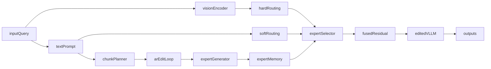

# AR-LiveEdit Thesis Plan

Version: `v1.0.0`  
Date: `2026-02-15`  
Status: Draft

## Goal

Build a new multimodal lifelong editor that can update long-form and structured targets (code-like, formula-like, multi-sentence) while preserving LiveEdit reliability, generality, and locality under sequential edits.

## Working Title

AR-LiveEdit: Autoregressive Chunked Lifelong Editing for Vision-Language Models

## Novelty Hypothesis

- LiveEdit is strong for lifelong multimodal editing but currently treats each edit target in a single pass.
- AnyEdit solves long-form and diverse-format editing in text LLMs via autoregressive chunked edits.
- Combining them yields a new capability: multimodal lifelong long-form knowledge editing.

## Core Technical Idea

1. Chunked edit decomposition (AnyEdit-style)
   - Split `target_new` into token chunks (`c1..cK`).
   - Train and infer sequentially: chunk `ck` optimizes generation of `c{k+1}` under image+prompt context.
2. Chunk-conditioned expert generation (LiveEdit-style)
   - For each chunk step, generate a low-rank expert residual.
   - Store either one expert per chunk, or a merged expert with chunk-level gates (ablation).
3. Dual routing extension
   - Keep visual hard routing and textual soft routing.
   - Add temporal/chunk routing to select the right chunk-expert at inference.
4. Conflict/overwrite extension (optional but strong)
   - Add serial overwrite benchmark where the same fact is updated multiple times.
   - Add recency-aware gate or timestamp-weighted fusion.

## Integration Points in This Codebase

- `train_vllm_editor.py` (training entry)
- `editor/vllm_editors/liveedit/liveedit.py` (core editor logic)
- `editor/vllm_editors/base.py` (training hooks/checkpoints)
- `dataset/vllm.py` (dataset loading/formatting)
- `evaluation/vllm_editor_eval.py` (evaluation protocol)
- `test_vllm_edit.py` (evaluation runner)

## Experimental Design

- Baselines:
  - Original LiveEdit
  - AnyEdit-style text-only adaptation (if feasible)
  - Chunked without routing (ablation)
- Datasets:
  - EVQA, EIC, VLKEB
  - New long-form multimodal subset (>64-token targets, diverse formats)
- Metrics:
  - Existing: reliability, generality, locality, edit time
  - New: long-form chunk EM/F1, format consistency (code/math), overwrite success
- Stress tests:
  - Sequential edits: 1/10/100/1000
  - Target length: 16/32/64/128+

## Ablations

- Chunk size: fixed vs adaptive
- Expert memory: per-chunk vs merged
- Routing: visual only vs text only vs visual+text vs visual+text+chunk-time
- Overwrite module: on/off

## Risk-Controlled Execution

- Phase 1 (minimum publishable):
  - Implement chunked train/infer with existing LiveEdit routing.
  - Show long-form gains with minimal locality regression.
- Phase 2 (novelty boost):
  - Add chunk-time routing and overwrite handling.
- Phase 3 (paper hardening):
  - Full ablations, significance tests, error analysis, memory/latency trade-offs.

## Deliverables

- AR chunking + routing extension code
- Long-form multimodal benchmark split and scripts
- Reproducible experiments and result tables/plots
- Thesis chapters and submission-ready manuscript

## Timeline (6-9 months)

- Month 1: finalize problem statement, curation protocol, literature gap
- Month 2-3: baseline reproduction + Phase 1 implementation
- Month 4-5: Phase 2 modules + ablations
- Month 6: stabilization + thesis writing v1
- Month 7-9: submission-quality experiments and paper submission

## Target Venues

- Conferences: ACL/EMNLP Findings, AAAI, IJCAI, COLING
- Journals: Neural Networks, Information Fusion, Knowledge-Based Systems, Expert Systems with Applications

## System Diagram

## Assumptions

- Strong novelty with manageable risk is preferred.
- BLIP2-level experiments are feasible in current environment.
- Adding a curated long-form multimodal split is acceptable as a thesis contribution.
