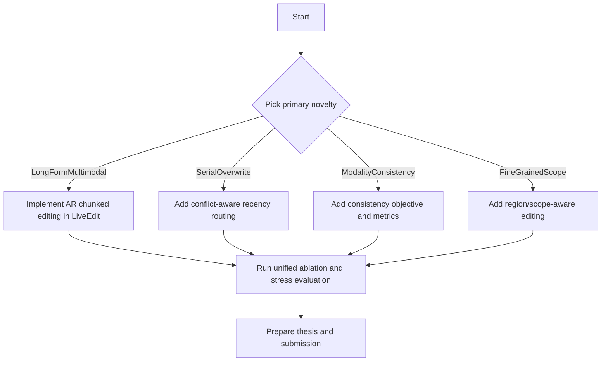

# Expanded Literature Review Plan for Novel Thesis Directions

Version: `v1.0.0`  
Date: `2026-02-15`  
Status: Draft

## What I Found (High-Confidence Related Work)

- **LiveEdit (CVPR 2025):** lifelong VLLM editing via generated low-rank experts + visual hard routing + textual soft routing.
- **AnyEdit (ICML 2025):** autoregressive chunked editing for long-form/diverse-format text knowledge.
- **MMKE-Bench (ICLR 2025):** stresses visual semantic and user-specific multimodal edits; current methods fail to dominate all metrics.
- **MC-MKE (ACL Findings 2025):** introduces modality consistency as a central requirement.
- **FGVEdit + MSCKE (ICCV 2025):** fine-grained visual-region-aware multimodal editing task and method.
- **Serial Lifelong Editing / ARM (ACL 2025):** repeated updates to same fact (overwrite conflicts) as a realistic setting.
- **MEMOIR (NeurIPS 2025):** sparse memory/write isolation to reduce interference across many sequential edits.
- **WikiBigEdit (ICML 2025):** large-scale evidence that many editing methods break at real-world scale.

## Gap Map (Where New Publishable Value Exists)

1. **No strong method unifies**: lifelong + multimodal + long-form/diverse outputs + overwrite robustness.
2. **Modality consistency** is benchmarked but under-optimized in most methods.
3. **Conflict-aware repeated updates** (same concept over time) are underexplored for VLLMs.
4. **Scalability evidence** for multimodal editors at large edit counts is still weak.

## Top Novel Thesis Directions

### Direction A (Recommended): AR-LiveEdit++

- Integrate AnyEdit-style chunked autoregressive editing into LiveEdit.
- Add chunk-aware expert routing and memory compression.
- Core claim: first practical framework for **multimodal lifelong long-form editing**.
- Why publishable: direct, testable, and clearly differentiated from both parent works.

### Direction B: Serial-Overwrite LiveEdit

- Add conflict-aware overwrite routing for repeated edits on same entity/fact.
- Include recency and confidence-aware gating to suppress stale experts.
- Core claim: robust **serial lifelong multimodal editing** under fact drift.

### Direction C: Modality-Consistent LiveEdit

- Introduce consistency loss/constraint between visual-grounded and text-grounded responses.
- Evaluate on MC-MKE/MMKE-style criteria and new consistency diagnostics.
- Core claim: better preservation of cross-modal consistency post-edit.

### Direction D: Fine-Grained Region-Scoped Editing

- Add region/scope localization before expert retrieval/edit application.
- Target multi-entity images to avoid collateral edits.
- Core claim: precise **scope-aware multimodal editing** with reduced side effects.

### Direction E: Reliability + Safety Hybrid Editing

- Couple knowledge editing with hallucination suppression or safety constraints.
- Core claim: editing improves both factual update and safety robustness.
- Higher risk for thesis timeline, but high impact if executed well.

## Most Publishable Combined Route (Balanced Risk/Impact)

- Primary: **Direction A**
- Secondary add-on: **Direction B**
- Optional paper extension: a small **Direction C** component (consistency metric + ablation)

## Validation Blueprint

- Baselines: LiveEdit, chunked-no-routing, routing-only, overwrite-only.
- Datasets: EVQA/EIC/VLKEB + one new long-form multimodal split.
- Metrics: reliability, generality, locality, portability, modality consistency, overwrite success, latency/memory.
- Stress tests: 1/10/100/1000+ edits, long targets (16/32/64/128+ tokens), repeated-overwrite episodes.

## Why This Is Q1/Top-Tier Friendly

- Addresses a concrete unmet need exposed by latest benchmarks.
- Combines methodological novelty + benchmark-level evidence + strong ablations.
- Produces reusable artifact: long-form multimodal edit protocol/split and reproducible pipeline.

## Decision Flow

## Immediate Next Step

- Lock one primary direction (A recommended) and one secondary direction (B recommended), then convert this into a milestone-by-milestone implementation spec tied to your current files.
